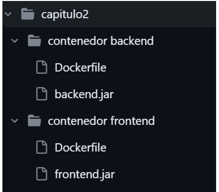
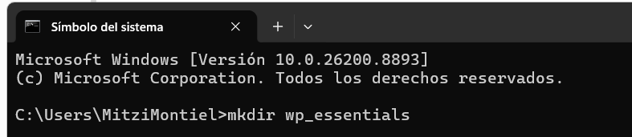
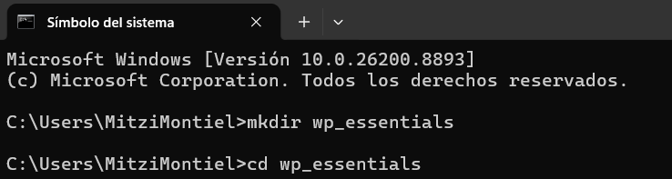
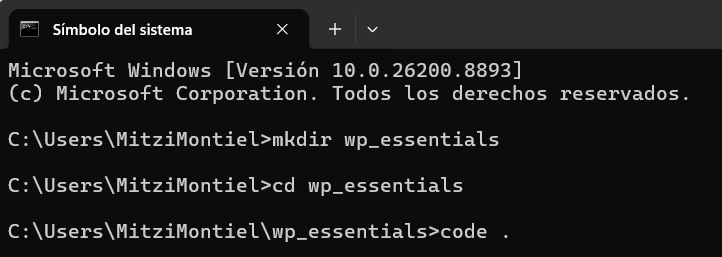
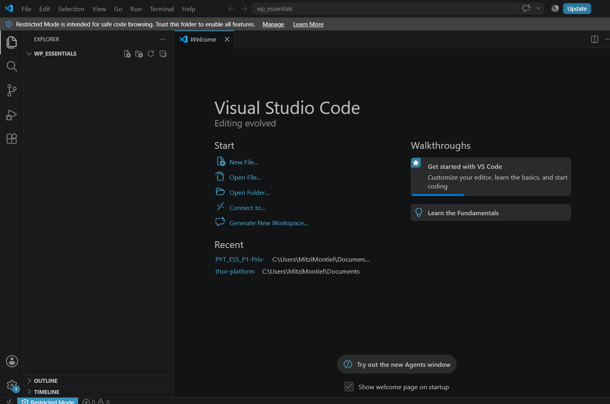
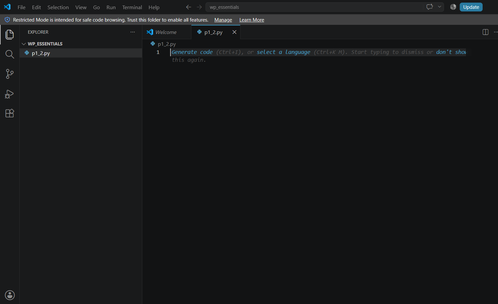
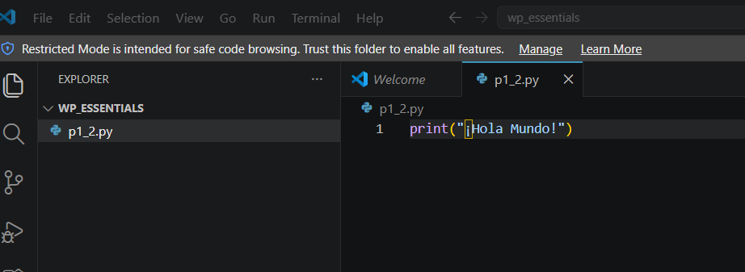
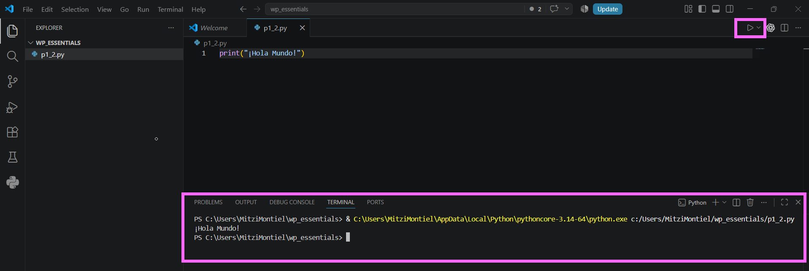
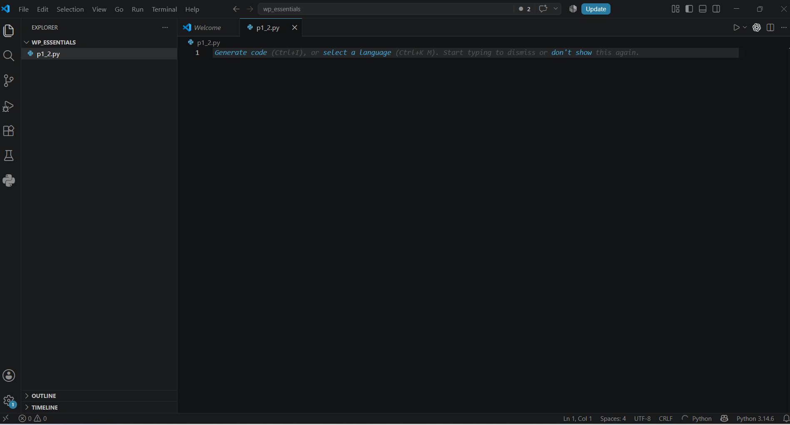

# Práctica 1.2. Hola Mundo con Python Script

## Objetivo de la práctica

Al finalizar esta práctica, serás capaz de:

- Crear un directorio de trabajo para proyectos en Python.
- Crear y ejecutar tu primer script en Python utilizando Visual Studio Code.
- Comprender el funcionamiento básico de la función `print()` y la ejecución de un programa en Python.

---

# Objetivo visual

Durante esta práctica crearás tu primer programa en Python desde cero.

```text
             Abrir Terminal
                    │
                    ▼
        Crear directorio de trabajo
                    │
                    ▼
      Abrir Visual Studio Code
                    │
                    ▼
      Crear archivo p1_2.py
                    │
                    ▼
         Escribir código Python
                    │
                    ▼
         Ejecutar el programa
                    │
                    ▼
          Visualizar la salida
                    │
                    ▼
      Analizar el comportamiento
```



---

## Duración aproximada

**7 minutos**

---

# Tabla de ayuda

| Recurso | Valor |
|---------|-------|
| Editor | Visual Studio Code |
| Lenguaje | Python 3 |
| Archivo | `p1_2.py` |
| Carpeta de trabajo | `wp_essentials` |
| Comando para ejecutar | `python p1_2.py` |

---

# Instrucciones

## Tarea 1. Crear el espacio de trabajo

### Paso 1. Abrir una terminal

Abrir una ventana de **Símbolo del sistema (CMD)**, **PowerShell** o una terminal del sistema operativo.


---

### Paso 2. Crear el directorio de trabajo

Ejecutar el siguiente comando:

```bash
mkdir wp_essentials
```

Este comando crea una nueva carpeta donde se almacenarán los programas desarrollados durante el curso.

> **Nota:** Si la carpeta ya existe, el sistema mostrará un mensaje indicando que el directorio ya fue creado.




---

### Paso 3. Acceder al directorio

Ejecutar:

```bash
cd wp_essentials
```

Verificar que la terminal indique que ahora se encuentra dentro del directorio.



---

### Paso 4. Abrir Visual Studio Code

Ejecutar el siguiente comando:

```bash
code .
```


Visual Studio Code deberá abrir la carpeta de trabajo.

> **Importante:** Si el comando `code` no es reconocido, consulte al instructor para habilitar el comando desde Visual Studio Code.



---

## Tarea 2. Crear el primer programa

### Paso 1. Crear un nuevo archivo

Crear un archivo llamado:

```text
p1_2.py
```



---

### Paso 2. Escribir el código

Agregar el siguiente código.

```python
print("¡Hola Mundo!")
```

Guardar el archivo.




---

### Paso 3. Ejecutar el programa

Puede ejecutar el programa utilizando cualquiera de las siguientes opciones.

**Opción 1**

Seleccionar el botón **Run Python File** ubicado en la esquina superior derecha.

**Opción 2**

Abrir una terminal integrada (**Terminal > New Terminal**) y ejecutar:

```bash
python p1_2.py
```



---

### Paso 4. Analizar la salida

Responder las siguientes preguntas.

- ¿Qué hace la función `print()`?
- ¿Qué sucede cuando modifica el texto entre comillas?
- ¿Qué ocurre si elimina una comilla?

---

### Paso 5. Observar los archivos generados

Revisar el Explorador de Visual Studio Code.

Responder:

- ¿Se generó un archivo ejecutable?
- ¿Por qué Python se considera un lenguaje interpretado?

---

# Validación

Verifique que realizó correctamente las siguientes actividades.

| Actividad | Completado |
|------------|------------|
| Creó la carpeta `wp_essentials` | ☐ |
| Abrió Visual Studio Code | ☐ |
| Creó el archivo `p1_2.py` | ☐ |
| Escribió el programa Hola Mundo | ☐ |
| Ejecutó correctamente el programa | ☐ |
| Analizó el funcionamiento de `print()` | ☐ |

---

# Resultado esperado

Al finalizar el laboratorio deberá visualizar una salida similar a la siguiente.

```text
¡Hola Mundo!
```



---

# Conclusión

En esta práctica creaste tu primer programa en Python utilizando Visual Studio Code. Aprendiste a organizar un proyecto, crear un archivo con extensión `.py`, ejecutar un script y visualizar la salida generada por la función `print()`.

También observaste que Python ejecuta directamente el código fuente sin generar un archivo ejecutable, característica propia de los lenguajes interpretados.

---

# Conocimientos adquiridos

Al finalizar esta práctica aprendiste a:

- Crear proyectos en Python.
- Utilizar Visual Studio Code para desarrollar programas.
- Ejecutar scripts desde el editor o la terminal.
- Utilizar la función `print()`.
- Comprender el proceso básico de ejecución de un programa en Python.