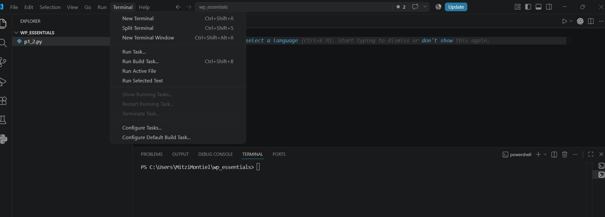
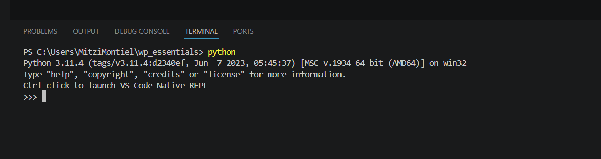
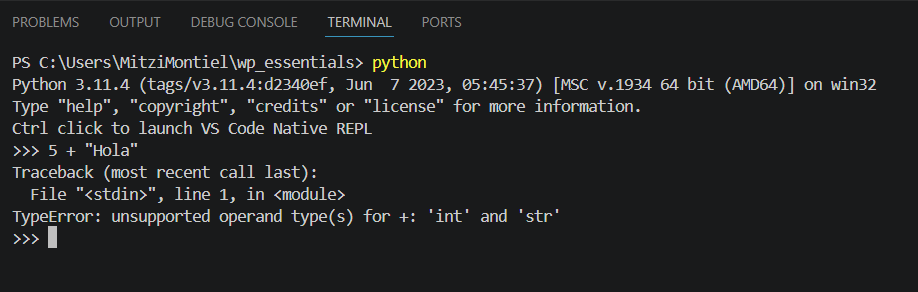
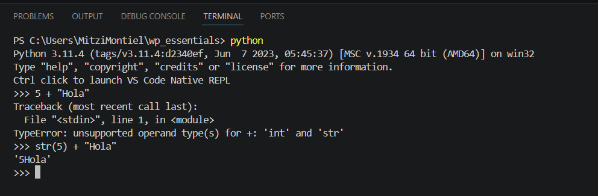
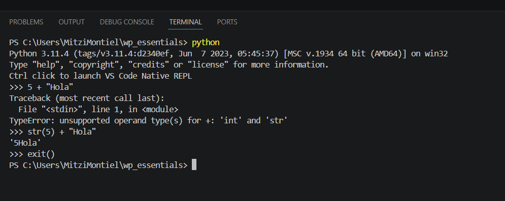
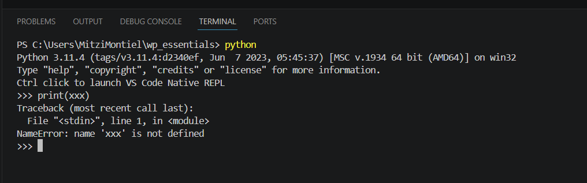
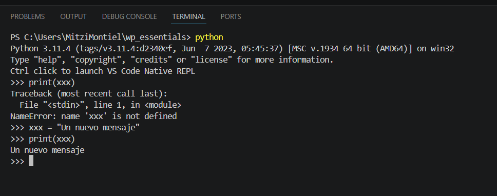

# Práctica 2.1. Consola interactiva de Python en Visual Studio Code

## Objetivo de la práctica

Al finalizar esta práctica, serás capaz de:

- Iniciar la consola interactiva de Python desde la terminal integrada de Visual Studio Code.
- Ejecutar instrucciones directamente en el intérprete de Python.
- Comprender la diferencia entre errores de tipo y errores por variables no definidas.
- Identificar el funcionamiento básico del intérprete interactivo de Python.

---

# Objetivo visual

En esta práctica utilizarás la consola interactiva de Python para ejecutar instrucciones y analizar el comportamiento del lenguaje.

```text
         Abrir Visual Studio Code
                    │
                    ▼
          Abrir una Terminal
                    │
                    ▼
      Iniciar la consola de Python
                    │
                    ▼
      Ejecutar expresiones simples
                    │
                    ▼
        Analizar los errores
                    │
                    ▼
      Declarar una variable
                    │
                    ▼
          Imprimir su contenido
                    │
                    ▼
      Salir del intérprete Python
```


---

## Duración aproximada

**5 minutos**

---

# Tabla de ayuda

| Recurso | Valor |
|---------|-------|
| Editor | Visual Studio Code |
| Intérprete | Python 3 |
| Terminal | Terminal integrada |
| Comando para iniciar Python | `python` |
| Comando para salir | `exit()` |

---

# Instrucciones

## Tarea 1. Iniciar la consola interactiva de Python

### Paso 1. Abrir Visual Studio Code

Abrir Visual Studio Code y verificar que el proyecto del curso se encuentre abierto.


---

### Paso 2. Abrir una terminal integrada

Ir al menú:

**Terminal → New Terminal**

También puede utilizar el atajo:

```
Ctrl + Shift + `
```

Se abrirá una terminal en la parte inferior del editor.



---

### Paso 3. Iniciar la consola interactiva

En la terminal escribir:

```bash
python
```

Deberá aparecer el prompt interactivo de Python similar al siguiente:

```text
>>>
```

> **Nota:** El símbolo `>>>` indica que el intérprete está listo para recibir instrucciones.




---

## Tarea 2. Experimentar con el intérprete

### Paso 1. Ejecutar una operación inválida

Escribir:

```python
5 + "Hola"
```

Observar el mensaje de error.

Responder:

- ¿Por qué se produjo el error?

> **Pista:** Python no permite sumar directamente un número entero con una cadena de texto.



---

### Paso 2. Corregir la operación

Escribir:

```python
str(5) + "Hola"
```

Observar el resultado.

Responder:

- ¿Qué hace la función `str()`?



---

### Paso 3. Salir del intérprete

Escribir:

```python
exit()
```

Volverá a la terminal del sistema.



---

## Tarea 3. Comprender el uso de variables

### Paso 1. Iniciar nuevamente el intérprete

Ejecutar nuevamente:

```bash
python
```

---

### Paso 2. Intentar imprimir una variable inexistente

Escribir:

```python
print(xxx)
```

Observar el mensaje de error.

Responder:

- ¿Qué significa el error mostrado?
- ¿Por qué Python no puede imprimir la variable?



---

### Paso 3. Declarar una variable

Escribir:

```python
xxx = "Un nuevo mensaje"
```

Después ejecutar:

```python
print(xxx)
```

Verificar que el mensaje se imprima correctamente.



---

### Paso 4. Salir del intérprete

Escribir:

```python
exit()
```

---

# Validación

Verifique que realizó correctamente las siguientes actividades.

| Actividad | Completado |
|------------|------------|
| Abrió la terminal integrada de VS Code | ☐ |
| Inició el intérprete de Python | ☐ |
| Identificó un TypeError | ☐ |
| Utilizó correctamente la función `str()` | ☐ |
| Identificó un NameError | ☐ |
| Declaró una variable | ☐ |
| Imprimió el contenido de la variable | ☐ |

---

# Resultado esperado

Al finalizar la práctica deberá comprender la diferencia entre:

- Un error de tipo (**TypeError**).
- Un error por variable inexistente (**NameError**).
- El funcionamiento básico del intérprete interactivo de Python.

---

# Conclusión

En esta práctica utilizaste el intérprete interactivo de Python desde la terminal integrada de Visual Studio Code. Aprendiste a ejecutar instrucciones de forma inmediata, identificar errores comunes y crear variables para almacenar información.

El intérprete interactivo es una excelente herramienta para realizar pruebas rápidas antes de escribir programas completos.

---

# Conocimientos adquiridos

Al finalizar esta práctica aprendiste a:

- Utilizar la consola interactiva de Python.
- Ejecutar instrucciones desde Visual Studio Code.
- Comprender los errores TypeError y NameError.
- Declarar variables.
- Convertir tipos de datos utilizando la función `str()`.

