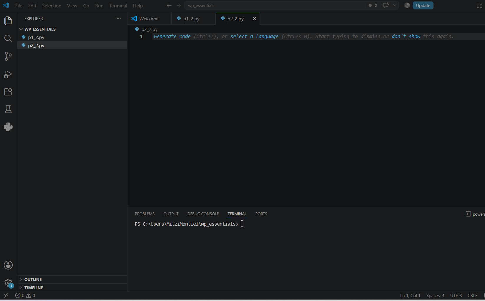
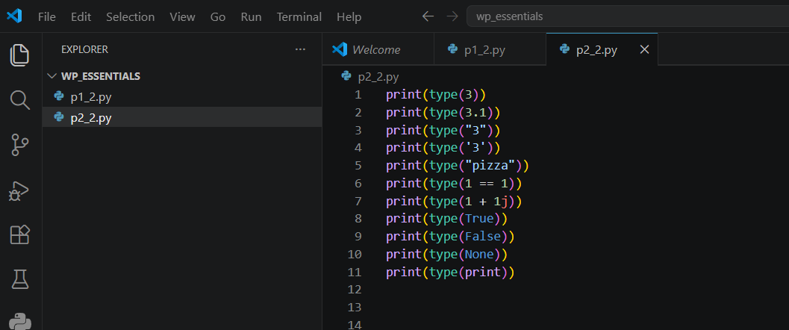
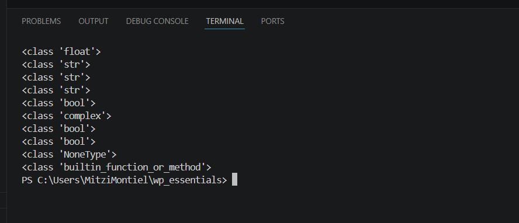

# Práctica 2.2. Explorando tipos de datos

## Objetivo de la práctica

Al finalizar esta práctica, serás capaz de:

- Utilizar la función `type()` para identificar el tipo de dato de diferentes expresiones.
- Crear un script en Python que muestre información en la consola.
- Reconocer los tipos de datos básicos disponibles en Python.

---

# Objetivo visual

Durante esta práctica crearás un programa que utilizará la función `type()` para identificar distintos tipos de datos.

```text
      Abrir Visual Studio Code
                 │
                 ▼
        Crear el archivo p2_2.py
                 │
                 ▼
      Escribir llamadas a type()
                 │
                 ▼
      Mostrar resultados con print()
                 │
                 ▼
         Ejecutar el programa
                 │
                 ▼
      Analizar los tipos obtenidos
```


---

## Duración aproximada

**7 minutos**

---

# Tabla de ayuda

| Recurso | Valor |
|---------|-------|
| Editor | Visual Studio Code |
| Lenguaje | Python 3 |
| Archivo | `p2_2.py` |
| Funciones utilizadas | `print()`, `type()` |

---

# Instrucciones

## Tarea 1. Crear el programa

### Paso 1. Abrir Visual Studio Code

Abrir Visual Studio Code y abrir la carpeta del laboratorio WP_ESSENTIALS.
---

### Paso 2. Crear un nuevo archivo

Crear un archivo llamado:

```text
p2_2.py
```



---

### Paso 3. Escribir el siguiente código

Agregar el siguiente programa.

```python
print(type(3))
print(type(3.1))
print(type("3"))
print(type('3'))
print(type("pizza"))
print(type(1 == 1))
print(type(1 + 1j))
print(type(True))
print(type(False))
print(type(None))
print(type(print))
```



Guardar el archivo.

---

## Tarea 2. Ejecutar el programa

### Paso 1. Ejecutar el script

Ejecutar el programa utilizando el botón **Run Python File** o mediante la terminal.

```bash
python p2_2.py
```

Observar la salida mostrada en la terminal.




---

### Paso 2. Analizar los resultados

Comparar cada resultado con la expresión evaluada.

| Expresión | Tipo obtenido |
|-----------|---------------|
| `3` | |
| `3.1` | |
| `"3"` | |
| `'3'` | |
| `"pizza"` | |
| `1 == 1` | |
| `1 + 1j` | |
| `True` | |
| `False` | |
| `None` | |
| `print` | |

---

## Tarea 3. Analizar la información

Responder las siguientes preguntas.

1. ¿Qué diferencia existe entre `3` y `"3"`?

2. ¿Qué tipo de dato devuelve una comparación como `1 == 1`?

3. ¿Qué representa el tipo `NoneType`?

4. ¿Qué puede concluir acerca del uso de la función `type()`?

5. ¿Puede concluir que todos los elementos en Python poseen un tipo de dato? Justifique su respuesta.

---

# Validación

Verifique que realizó correctamente las siguientes actividades.

| Actividad | Completado |
|------------|------------|
| Creó el archivo `p2_2.py` | ☐ |
| Escribió el programa | ☐ |
| Ejecutó correctamente el script | ☐ |
| Identificó los tipos de datos | ☐ |
| Respondió las preguntas de análisis | ☐ |

---

# Resultado esperado

La salida del programa deberá ser similar a la siguiente:

```text
<class 'int'>
<class 'float'>
<class 'str'>
<class 'str'>
<class 'str'>
<class 'bool'>
<class 'complex'>
<class 'bool'>
<class 'bool'>
<class 'NoneType'>
<class 'builtin_function_or_method'>
```

---

# Conclusión

En esta práctica desarrollaste un programa que utiliza la función `type()` para identificar el tipo de dato de diferentes expresiones. Observaste que números, cadenas de texto, valores booleanos, números complejos, funciones y el valor especial `None` poseen un tipo asociado.

Comprender los tipos de datos es fundamental para escribir programas correctos y aprovechar las capacidades del lenguaje Python.

---

# Conocimientos adquiridos

Al finalizar esta práctica aprendiste a:

- Utilizar la función `type()`.
- Mostrar resultados mediante `print()`.
- Identificar los principales tipos de datos de Python.
- Diferenciar entre datos numéricos, cadenas, valores booleanos y otros objetos.

