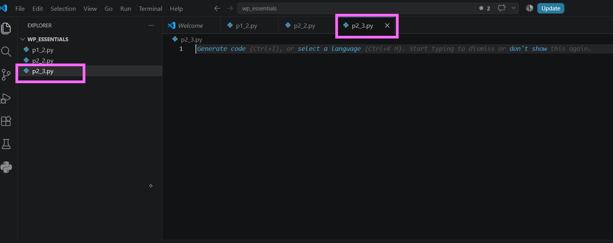
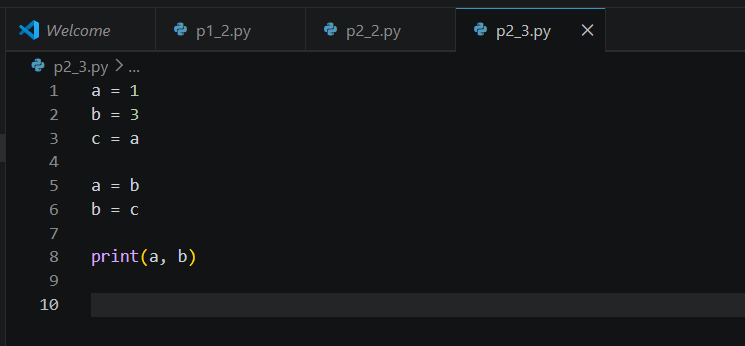
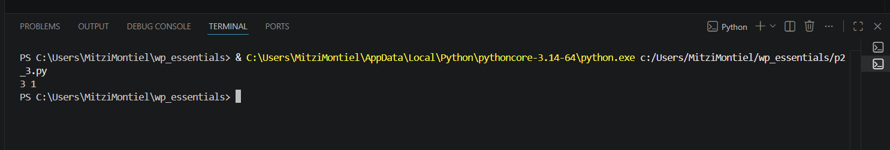
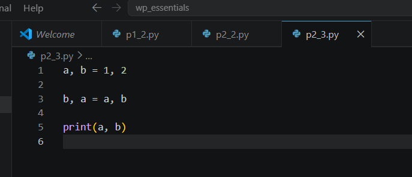
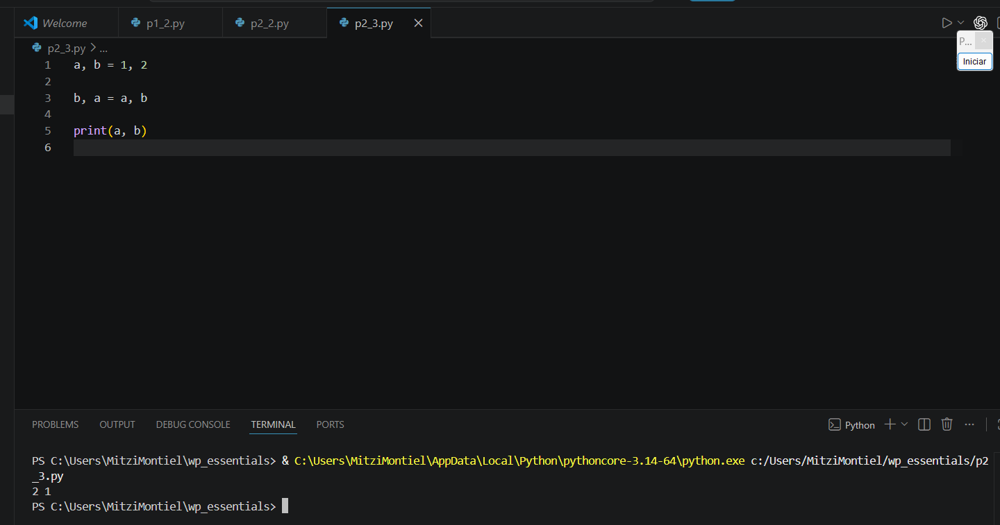
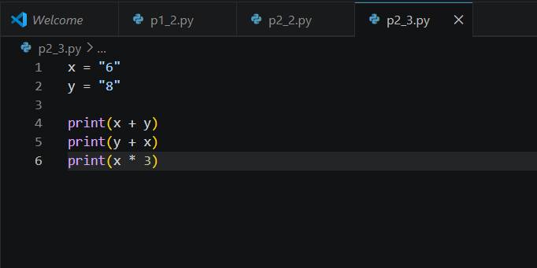
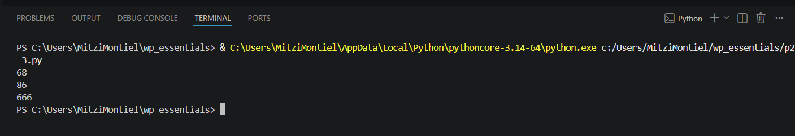
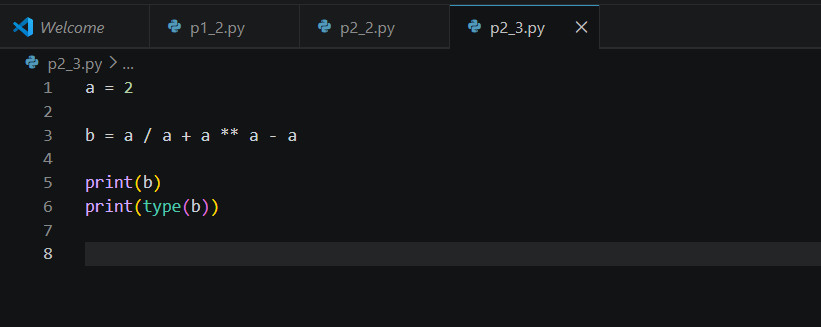
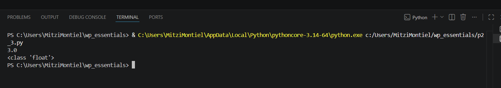

# Práctica 2.3. Expresiones y asignación de variables

## Objetivo de la práctica

Al finalizar esta práctica, serás capaz de:

- Comprender el funcionamiento de la asignación de variables en Python.
- Analizar cómo cambian los valores almacenados en las variables durante la ejecución de un programa.
- Evaluar expresiones aritméticas y expresiones con cadenas de texto utilizando operadores de Python.

---

# Objetivo visual

Durante esta práctica crearás un programa para experimentar con asignaciones de variables y expresiones.

```text
        Abrir Visual Studio Code
                   │
                   ▼
          Crear el archivo p2_3.py
                   │
                   ▼
      Escribir asignaciones de variables
                   │
                   ▼
        Ejecutar el programa
                   │
                   ▼
     Analizar los resultados obtenidos
                   │
                   ▼
     Experimentar con expresiones
                   │
                   ▼
        Obtener conclusiones
```


---

## Duración aproximada

**10 minutos**

---

# Tabla de ayuda

| Recurso | Valor |
|---------|-------|
| Editor | Visual Studio Code |
| Lenguaje | Python 3 |
| Archivo | `p2_3.py` |
| Función utilizada | `print()` |

---

# Instrucciones

## Tarea 1. Comprender la asignación de variables

### Paso 1. Crear un nuevo archivo

Crear un archivo llamado:

```text
p2_3.py
```


---

### Paso 2. Escribir el siguiente código

Agregar las siguientes instrucciones.

```python
a = 1
b = 3
c = a

a = b
b = c

print(a, b)
```

Guardar el archivo.




---

### Paso 3. Ejecutar el programa

Ejecutar el archivo utilizando el botón **Run Python File** o mediante la terminal.

```bash
python p2_3.py
```

Observar el resultado.

Responder:

- ¿Cuál fue el valor final de `a`?
- ¿Cuál fue el valor final de `b`?
- ¿Por qué ocurrió ese resultado?

**Captura esperada**


```

---

## Tarea 2. Intercambiar valores utilizando asignación múltiple

### Paso 1. Reemplazar el código anterior

Sustituir el contenido del archivo por el siguiente código.

```python
a, b = 1, 2

b, a = a, b

print(a, b)
```

Guardar el archivo.



---

### Paso 2. Ejecutar nuevamente el programa

Ejecutar el script y observar el resultado.

Responder:

- ¿Qué ventaja tiene la asignación múltiple?
- ¿Fue necesario utilizar una variable auxiliar?




---

## Tarea 3. Explorar expresiones con cadenas

### Paso 1. Reemplazar el código por el siguiente

```python
x = "6"
y = "8"

print(x + y)
print(y + x)
print(x * 3)
```

Guardar el archivo.



---

### Paso 2. Ejecutar el programa

Observar cuidadosamente los resultados obtenidos.

Responder:

- ¿Qué operación realiza el operador `+` cuando trabaja con cadenas?
- ¿Qué operación realiza el operador `*` cuando trabaja con cadenas?




---

## Tarea 4. Evaluar una expresión aritmética

### Paso 1. Agregar el siguiente código

```python
a = 2

b = a / a + a ** a - a

print(b)
print(type(b))
```

Guardar el archivo.



---

### Paso 2. Ejecutar el programa

Analizar el resultado obtenido.

Responder:

- ¿Cuál fue el valor almacenado en `b`?
- ¿Qué tipo de dato tiene la variable `b`?
- ¿Qué operador tiene mayor prioridad en la expresión?



---

# Validación

Verifique que realizó correctamente las siguientes actividades.

| Actividad | Completado |
|------------|------------|
| Creó el archivo `p2_3.py` | ☐ |
| Ejecutó el primer programa | ☐ |
| Comprendió el intercambio de variables | ☐ |
| Utilizó asignación múltiple | ☐ |
| Evaluó expresiones con cadenas | ☐ |
| Evaluó expresiones aritméticas | ☐ |
| Identificó el tipo de dato del resultado | ☐ |

---

# Resultado esperado

Al finalizar la práctica comprenderá que:

- Las variables pueden cambiar su valor durante la ejecución del programa.
- Python permite intercambiar variables mediante asignación múltiple.
- El operador `+` concatena cadenas de texto.
- El operador `*` repite cadenas de texto.
- Los operadores aritméticos respetan un orden de precedencia.

---

# Conclusión

Durante esta práctica experimentaste con la asignación de variables y la evaluación de expresiones en Python. Observaste cómo cambian los valores almacenados en las variables, cómo es posible intercambiar valores utilizando asignación múltiple y cómo los operadores pueden comportarse de forma diferente dependiendo del tipo de dato con el que trabajan.

También comprobaste que Python respeta un orden de precedencia al evaluar expresiones aritméticas, lo que permite obtener resultados consistentes y predecibles.

---

# Conocimientos adquiridos

Al finalizar esta práctica aprendiste a:

- Asignar valores a variables.
- Intercambiar valores mediante asignación múltiple.
- Utilizar el operador `+` para concatenar cadenas.
- Utilizar el operador `*` para repetir cadenas.
- Evaluar expresiones aritméticas.
- Identificar el tipo de dato del resultado mediante `type()`.

