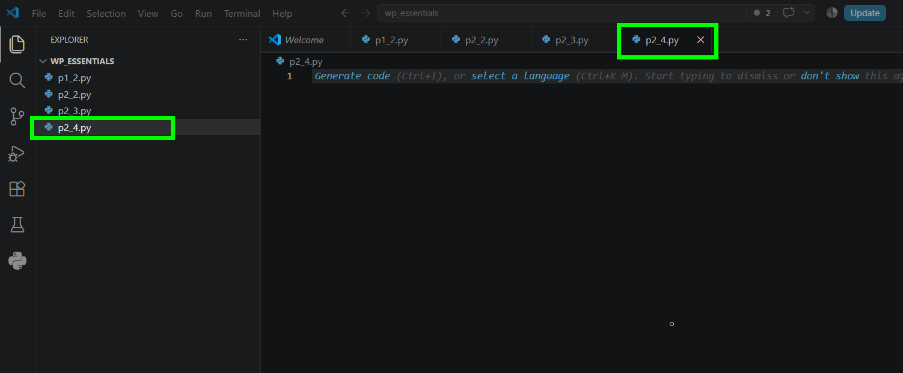
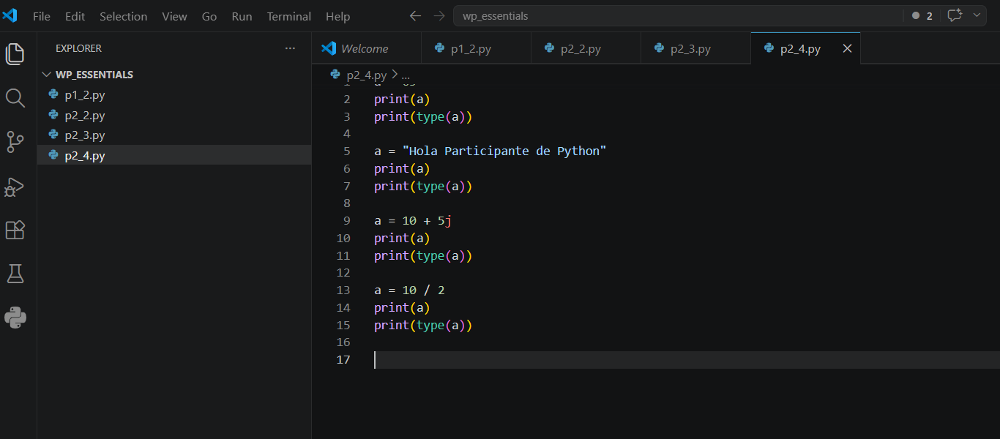
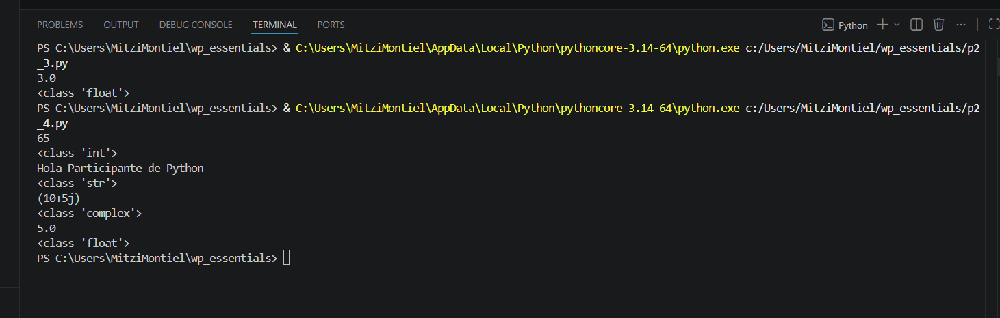

# Práctica 2.4. Tipado dinámico

## Objetivo de la práctica

Al finalizar esta práctica, serás capaz de:

- Comprender el concepto de **tipado dinámico** en Python.
- Observar cómo una misma variable puede almacenar diferentes tipos de datos durante la ejecución del programa.
- Verificar el tipo de dato de una variable utilizando la función `type()`.

---

# Objetivo visual

Durante esta práctica crearás un programa que demostrará cómo una variable puede cambiar de tipo durante la ejecución.

```text
        Abrir Visual Studio Code
                   │
                   ▼
         Crear el archivo p2_4.py
                   │
                   ▼
       Asignar diferentes valores
                   │
                   ▼
      Utilizar la función type()
                   │
                   ▼
         Ejecutar el programa
                   │
                   ▼
      Analizar los resultados
                   │
                   ▼
      Comprender el tipado dinámico
```

---

## Duración aproximada

**10 minutos**

---

# Tabla de ayuda

| Recurso | Valor |
|---------|-------|
| Editor | Visual Studio Code |
| Lenguaje | Python 3 |
| Archivo | `p2_4.py` |
| Funciones utilizadas | `print()`, `type()` |

---

# Instrucciones

## Tarea 1. Crear el programa

### Paso 1. Crear un nuevo archivo

Crear un archivo llamado:

```text
p2_4.py
```



---

### Paso 2. Escribir el siguiente código

Agregar el siguiente programa.

```python
a = 65
print(a)
print(type(a))

a = "Hola Participante de Python"
print(a)
print(type(a))

a = 10 + 5j
print(a)
print(type(a))

a = 10 / 2
print(a)
print(type(a))
```

Guardar el archivo.



---

## Tarea 2. Ejecutar el programa

### Paso 1. Ejecutar el script

Ejecutar el programa utilizando el botón **Run Python File** o mediante la terminal.

```bash
python p2_4.py
```

Observar cuidadosamente la salida generada.



---

### Paso 2. Analizar los resultados

Completar la siguiente tabla.

| Valor asignado | Tipo de dato |
|---------------|--------------|
| `65` | |
| `"Hola Participante de Python"` | |
| `10 + 5j` | |
| `10 / 2` | |

---

## Tarea 3. Reflexionar sobre el tipado dinámico

Responder las siguientes preguntas.

1. ¿Cuántas veces cambió el contenido de la variable `a`?

2. ¿Fue necesario declarar previamente el tipo de dato de la variable?

3. ¿Qué función permitió identificar el tipo de dato almacenado?

4. ¿Qué significa que Python sea un lenguaje de **tipado dinámico**?

5. ¿Qué ventajas considera que ofrece esta característica al desarrollar programas?

> **Nota:** En Python el tipo de dato no pertenece a la variable, sino al objeto que la variable referencia. Por ello, una misma variable puede almacenar distintos tipos de datos durante la ejecución del programa.

---

# Validación

Verifique que realizó correctamente las siguientes actividades.

| Actividad | Completado |
|------------|------------|
| Creó el archivo `p2_4.py` | ☐ |
| Escribió el programa | ☐ |
| Ejecutó correctamente el script | ☐ |
| Observó los cambios de tipo de la variable | ☐ |
| Utilizó la función `type()` | ☐ |
| Respondió las preguntas de análisis | ☐ |

---

# Resultado esperado

Al finalizar la práctica deberá observar una salida similar a la siguiente.

```text
65
<class 'int'>

Hola Participante de Python
<class 'str'>

(10+5j)
<class 'complex'>

5.0
<class 'float'>
```


---

# Conclusión

En esta práctica comprobaste que una misma variable puede almacenar distintos tipos de datos durante la ejecución del programa sin necesidad de declarar previamente su tipo. Este comportamiento es una de las principales características de Python y se conoce como **tipado dinámico**.

También verificaste que la función `type()` permite identificar el tipo del objeto almacenado en una variable en cualquier momento del programa.

---

# Conocimientos adquiridos

Al finalizar esta práctica aprendiste a:

- Comprender el concepto de tipado dinámico.
- Reutilizar una misma variable con distintos tipos de datos.
- Identificar el tipo de un objeto mediante la función `type()`.
- Diferenciar entre el nombre de una variable y el objeto que referencia.