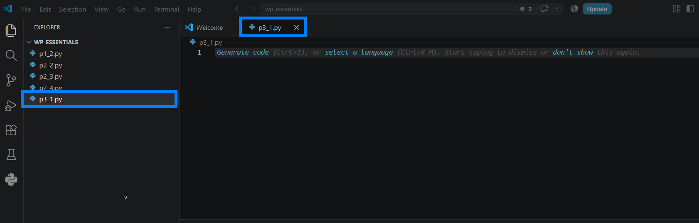
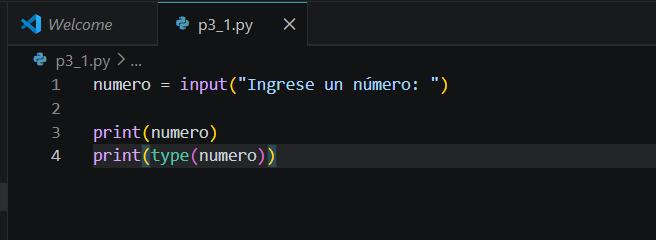
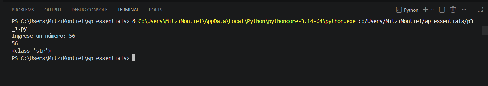
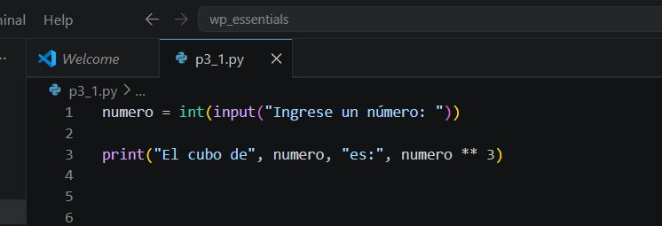
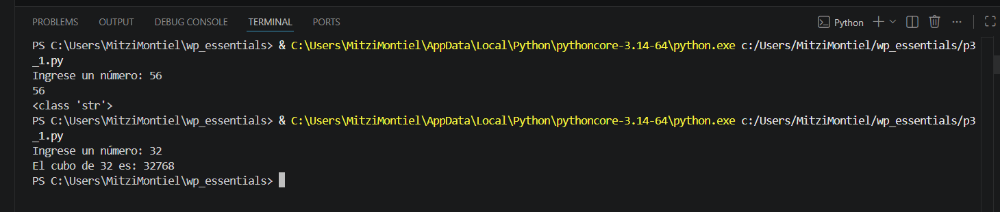
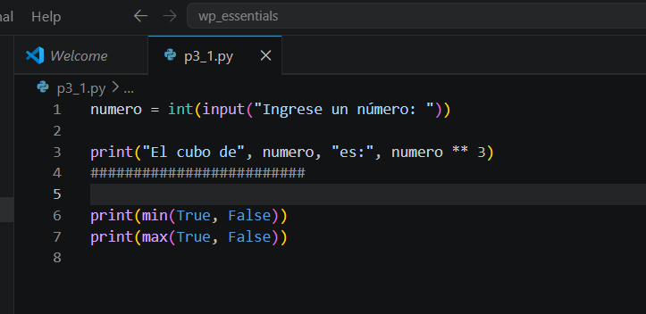
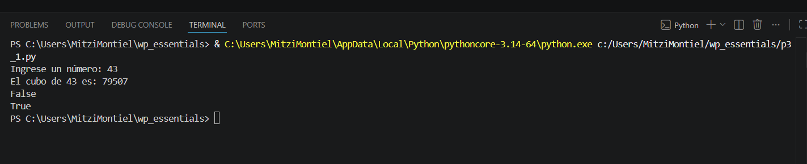
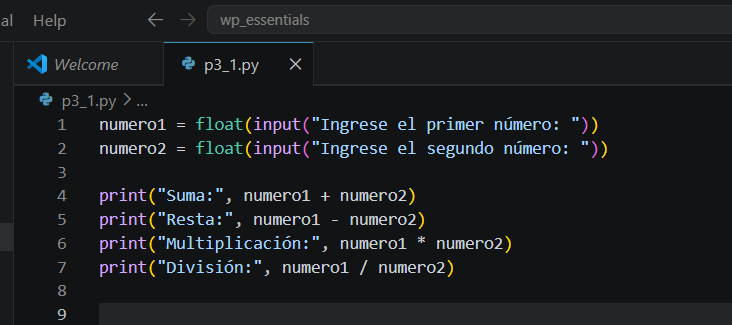
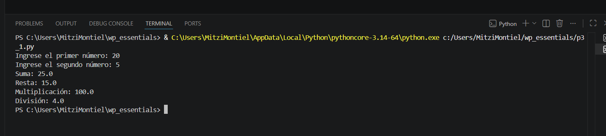

# Práctica 3.1. Expresiones y entrada de datos

## Objetivo de la práctica

Al finalizar esta práctica, serás capaz de:

- Solicitar información al usuario utilizando la función `input()`.
- Comprender que la función `input()` siempre devuelve una cadena de caracteres.
- Realizar operaciones aritméticas con datos ingresados por el usuario mediante la conversión de tipos.
- Evaluar expresiones booleanas utilizando las funciones `min()` y `max()`.

---

# Objetivo visual

Durante esta práctica desarrollarás un programa que interactúa con el usuario mediante la entrada de datos.

```text
        Abrir Visual Studio Code
                   │
                   ▼
         Crear el archivo p3_1.py
                   │
                   ▼
     Solicitar datos con input()
                   │
                   ▼
      Convertir datos numéricos
                   │
                   ▼
      Realizar operaciones
                   │
                   ▼
      Mostrar resultados
                   │
                   ▼
      Analizar expresiones booleanas
```


---

## Duración aproximada

**8 minutos**

---

# Tabla de ayuda

| Recurso | Valor |
|---------|-------|
| Editor | Visual Studio Code |
| Lenguaje | Python 3 |
| Archivo | `p3_1.py` |
| Funciones utilizadas | `input()`, `print()`, `int()`, `min()`, `max()` |

---

# Instrucciones

## Tarea 1. Solicitar un dato al usuario

### Paso 1. Crear un nuevo archivo

Crear un archivo llamado:

```text
p3_1.py
```


---

### Paso 2. Solicitar un número

Escribir el siguiente código.

```python
numero = input("Ingrese un número: ")

print(numero)
print(type(numero))
```

Guardar el archivo.




---

### Paso 3. Ejecutar el programa

Ejecutar el programa y escribir cualquier número cuando sea solicitado.

Observar el tipo de dato mostrado por la función `type()`.

Responder:

- ¿Qué tipo de dato devuelve la función `input()`?



---

## Tarea 2. Calcular el cubo de un número

### Paso 1. Modificar el programa

Reemplazar el código anterior por el siguiente.

```python
numero = int(input("Ingrese un número: "))

print("El cubo de", numero, "es:", numero ** 3)
```

Guardar el archivo.

> **Nota:** La función `int()` convierte la cadena de texto capturada por `input()` en un número entero.




---

### Paso 2. Ejecutar el programa

Ingresar un número y verificar el resultado obtenido.

Responder:

- ¿Qué operador se utilizó para calcular el cubo?



---

## Tarea 3. Evaluar expresiones booleanas

### Paso 1. Agregar el siguiente código

```python
print(min(True, False))
print(max(True, False))
```

Guardar el archivo y ejecutar nuevamente.




Responder:

- ¿Qué resultado devuelve `min(True, False)`?
- ¿Qué resultado devuelve `max(True, False)`?




---

## Tarea 4. Crear una calculadora básica

### Paso 1. Reemplazar el código anterior

Escribir el siguiente programa.

```python
numero1 = float(input("Ingrese el primer número: "))
numero2 = float(input("Ingrese el segundo número: "))

print("Suma:", numero1 + numero2)
print("Resta:", numero1 - numero2)
print("Multiplicación:", numero1 * numero2)
print("División:", numero1 / numero2)
```

Guardar el archivo.



---

### Paso 2. Ejecutar el programa

Ingresar dos números y verificar los resultados.

Responder:

- ¿Por qué en esta ocasión se utilizó `float()` en lugar de `int()`?
- ¿Qué ocurre si el segundo número ingresado es cero?



---

# Validación

Verifique que realizó correctamente las siguientes actividades.

| Actividad | Completado |
|------------|------------|
| Creó el archivo `p3_1.py` | ☐ |
| Utilizó la función `input()` | ☐ |
| Convirtió datos con `int()` | ☐ |
| Calculó el cubo de un número | ☐ |
| Evaluó las funciones `min()` y `max()` | ☐ |
| Desarrolló una calculadora básica | ☐ |

---

# Resultado esperado

Al finalizar la práctica deberá ser capaz de interactuar con el usuario mediante la función `input()` y realizar operaciones aritméticas utilizando los datos capturados.

También comprenderá que la función `input()` devuelve una cadena de caracteres y que es necesario convertirla cuando se desea realizar operaciones matemáticas.


---

# Conclusión

En esta práctica aprendiste a crear programas interactivos que solicitan información al usuario mediante la función `input()`. También comprobaste la importancia de convertir los datos capturados antes de utilizarlos en operaciones matemáticas y reforzaste el uso de operadores aritméticos y funciones integradas de Python.

La interacción con el usuario es una de las características fundamentales en el desarrollo de aplicaciones y será utilizada constantemente en los siguientes capítulos.

---

# Conocimientos adquiridos

Al finalizar esta práctica aprendiste a:

- Utilizar la función `input()`.
- Convertir cadenas de texto a valores numéricos mediante `int()` y `float()`.
- Calcular potencias utilizando el operador `**`.
- Evaluar expresiones booleanas con `min()` y `max()`.
- Desarrollar programas interactivos que solicitan información al usuario.

