# Práctica 3.2. Métodos de las cadenas de caracteres

## Objetivo de la práctica

Al finalizar esta práctica, serás capaz de:

- Utilizar los principales métodos de las cadenas de caracteres en Python.
- Aplicar operaciones de búsqueda, transformación y limpieza de texto.
- Comprender que los métodos de las cadenas devuelven un nuevo valor sin modificar la cadena original.

---

# Objetivo visual

Durante esta práctica desarrollarás un programa para manipular cadenas de caracteres utilizando los métodos integrados de Python.

```text
        Abrir Visual Studio Code
                   │
                   ▼
         Crear el archivo p3_2.py
                   │
                   ▼
      Solicitar una frase al usuario
                   │
                   ▼
      Aplicar métodos de cadenas
                   │
                   ▼
        Ejecutar el programa
                   │
                   ▼
      Analizar los resultados
```
---

## Duración aproximada

**8 minutos**

---

# Tabla de ayuda

| Recurso | Valor |
|---------|-------|
| Editor | Visual Studio Code |
| Lenguaje | Python 3 |
| Archivo | `p3_2.py` |
| Funciones utilizadas | `input()`, `print()`, `len()` |
| Métodos utilizados | `upper()`, `lower()`, `strip()`, `replace()`, `join()` |

---

# Instrucciones

## Tarea 1. Capturar una frase

### Paso 1. Crear un nuevo archivo

Crear un archivo llamado:

```text
p3_2.py
```

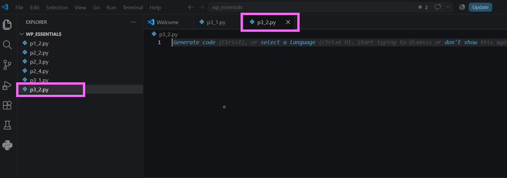

---

### Paso 2. Escribir el siguiente código

```python
frase = input("Ingrese una frase: ")

print("Frase original:")
print(frase)
```

Guardar el archivo.

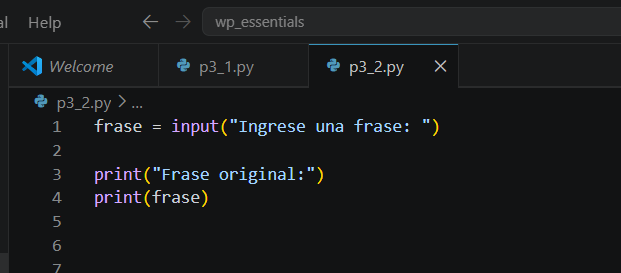

---

### Paso 3. Ejecutar el programa

Ingresar cualquier frase.

Verificar que el texto ingresado se muestre correctamente.

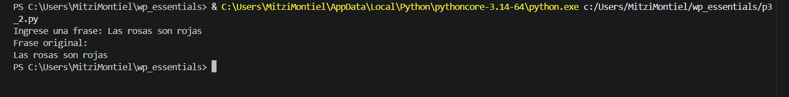

---

## Tarea 2. Explorar métodos de cadenas

### Paso 1. Mostrar la longitud de la cadena

Agregar la siguiente instrucción.

```python
print("Cantidad de caracteres:", len(frase))
```
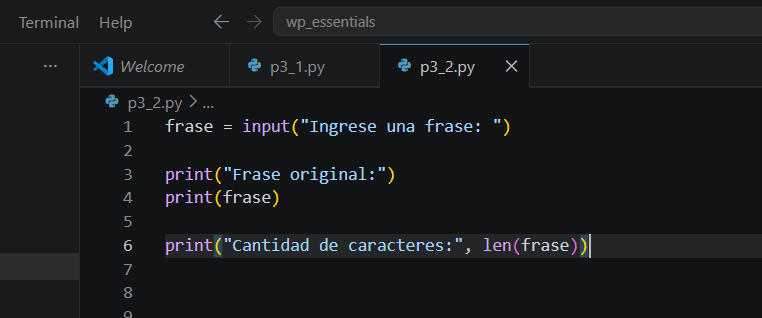

Ejecutar nuevamente el programa.

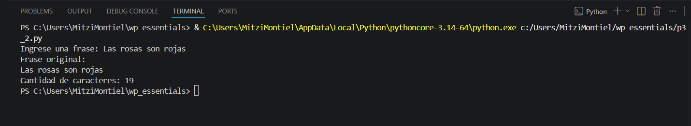

---

### Paso 2. Verificar si existe una palabra

Agregar el siguiente código.

```python
print("Python" in frase)
```
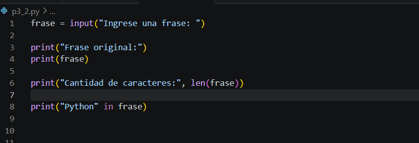

Ejecutar nuevamente el programa.

> **Nota:** El operador `in` verifica si una subcadena se encuentra dentro de otra cadena.

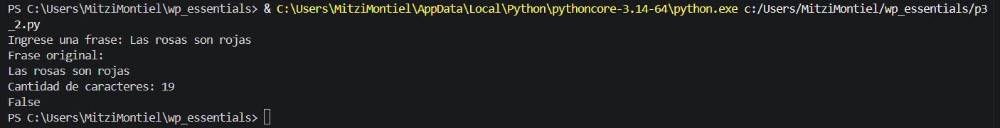

---

### Paso 3. Convertir la cadena a mayúsculas

Agregar:

```python
print(frase.upper())
```
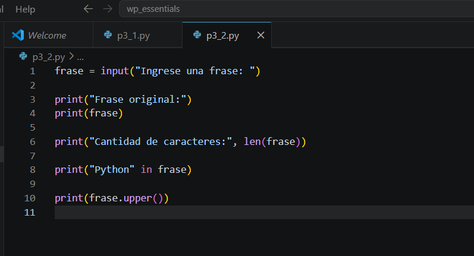


---

### Paso 4. Convertir la cadena a minúsculas

Agregar:

```python
print(frase.lower())
```

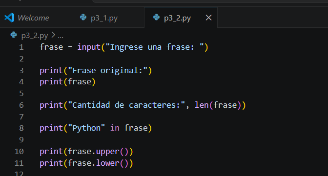

Observa la salida al ejecutar el código:

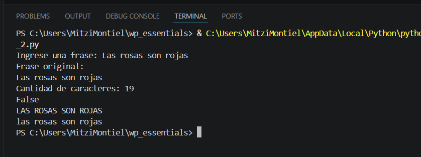


---

### Paso 5. Eliminar espacios al inicio y al final

Agregar:

```python
print(frase.strip())
```

Después agregar:

```python
print("Longitud original:", len(frase))
print("Longitud sin espacios:", len(frase.strip()))
```


Responder:

- ¿Por qué la longitud de la variable `frase` no cambia?

> **Pista:** Los métodos de las cadenas devuelven una nueva cadena y no modifican la original.


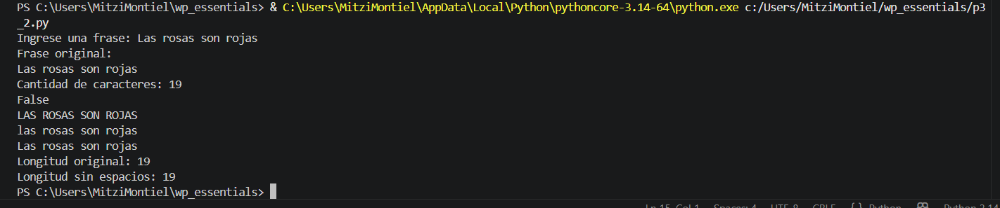


---

### Paso 6. Reemplazar caracteres

Agregar:

```python
print(frase.replace("a", "A"))
```

Ejecutar nuevamente el programa.

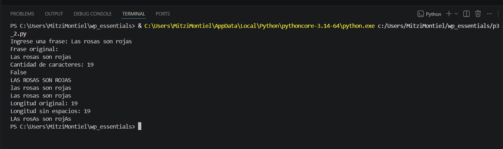


---

### Paso 7. Utilizar el método `join()`

Agregar el siguiente código.

```python
print("\n".join("Hola Python"))
```

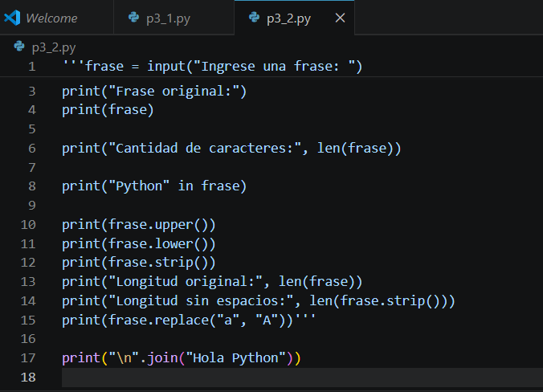

Ejecutar nuevamente el programa.

Responder:

- ¿Qué hace el método `join()`?
- ¿Por qué aparece cada carácter en una línea diferente?

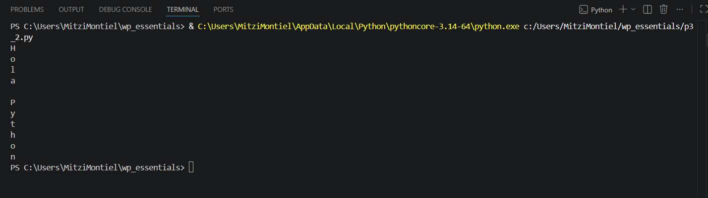

---

## Tarea 3. Analizar los resultados

Responder las siguientes preguntas.

1. ¿Qué método convierte una cadena a mayúsculas?

2. ¿Qué método convierte una cadena a minúsculas?

3. ¿Qué hace el método `strip()`?

4. ¿Cuál es la diferencia entre `replace()` y `strip()`?

5. ¿Por qué los métodos de las cadenas no modifican la variable original?

---

# Validación

Verifique que realizó correctamente las siguientes actividades.

| Actividad | Completado |
|------------|------------|
| Creó el archivo `p3_2.py` | ☐ |
| Capturó una frase con `input()` | ☐ |
| Calculó la longitud con `len()` | ☐ |
| Utilizó el operador `in` | ☐ |
| Aplicó `upper()` | ☐ |
| Aplicó `lower()` | ☐ |
| Aplicó `strip()` | ☐ |
| Aplicó `replace()` | ☐ |
| Utilizó el método `join()` | ☐ |

---

# Resultado esperado

Al finalizar la práctica el participante comprenderá que las cadenas de caracteres disponen de numerosos métodos que permiten manipular texto de forma sencilla y eficiente.

También observará que los métodos de las cadenas generan nuevas cadenas de caracteres, manteniendo intacto el contenido original.


---

# Conclusión

En esta práctica exploraste algunos de los métodos más utilizados para manipular cadenas de caracteres en Python. Aprendiste a convertir texto a mayúsculas y minúsculas, eliminar espacios innecesarios, reemplazar caracteres y verificar si una subcadena se encuentra dentro de otra.

Además, comprobaste que las cadenas son objetos **inmutables**, por lo que los métodos no modifican el contenido original, sino que generan una nueva cadena con el resultado de la operación.

---

# Conocimientos adquiridos

Al finalizar esta práctica aprendiste a:

- Capturar cadenas de texto mediante `input()`.
- Obtener la longitud de una cadena con `len()`.
- Buscar subcadenas utilizando el operador `in`.
- Convertir texto con `upper()` y `lower()`.
- Eliminar espacios con `strip()`.
- Reemplazar caracteres con `replace()`.
- Utilizar el método `join()`.
- Comprender la inmutabilidad de las cadenas en Python.

