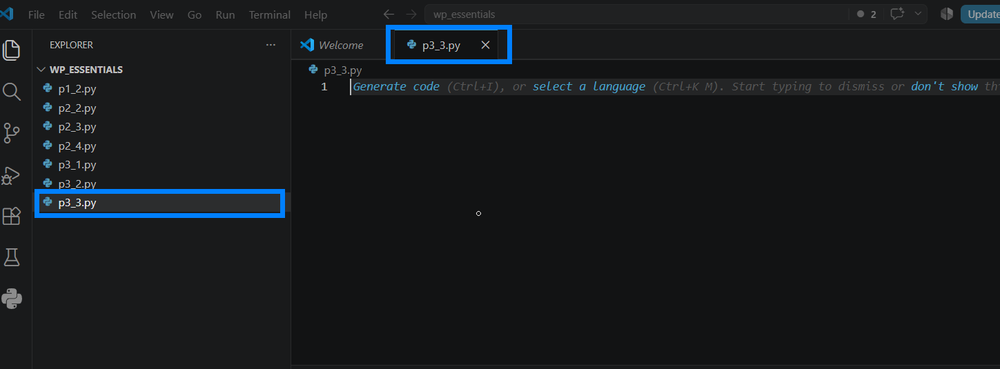
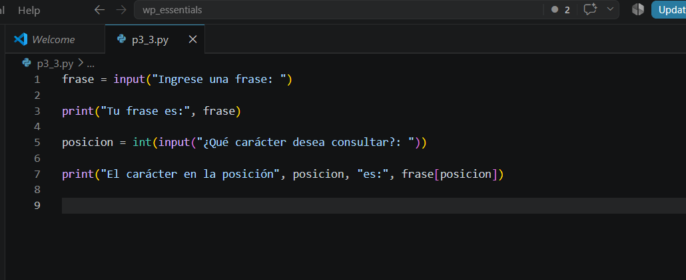
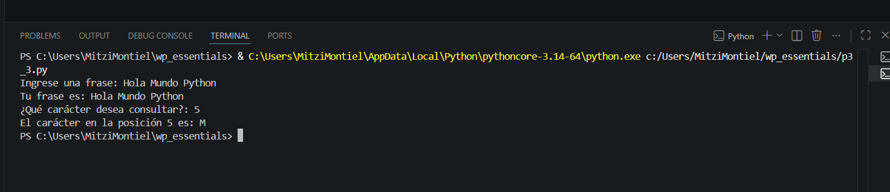

# Práctica 3.3. Indexación de cadenas

## Objetivo de la práctica

Al finalizar esta práctica, serás capaz de:

- Acceder a caracteres individuales de una cadena mediante su posición.
- Comprender el funcionamiento de la indexación en Python.
- Obtener un carácter específico utilizando un índice proporcionado por el usuario.

---

# Objetivo visual

Durante esta práctica desarrollarás un programa que permitirá localizar un carácter dentro de una cadena utilizando su posición.

```text
        Abrir Visual Studio Code
                   │
                   ▼
         Crear el archivo p3_3.py
                   │
                   ▼
      Solicitar una frase al usuario
                   │
                   ▼
      Solicitar una posición
                   │
                   ▼
      Obtener el carácter mediante []
                   │
                   ▼
      Mostrar el resultado
                   │
                   ▼
      Analizar la indexación
```

---

## Duración aproximada

**8 minutos**

---

# Tabla de ayuda

| Recurso | Valor |
|---------|-------|
| Editor | Visual Studio Code |
| Lenguaje | Python 3 |
| Archivo | `p3_3.py` |
| Funciones utilizadas | `input()`, `print()`, `int()` |
| Operador utilizado | `[]` (indexación) |

---

# Instrucciones

## Tarea 1. Crear el programa

### Paso 1. Crear un nuevo archivo

Crear un archivo llamado:

```text
p3_3.py
```


---

### Paso 2. Escribir el siguiente código

Agregar el siguiente programa.

```python
frase = input("Ingrese una frase: ")

print("Tu frase es:", frase)

posicion = int(input("¿Qué carácter desea consultar?: "))

print("El carácter en la posición", posicion, "es:", frase[posicion])
```

Guardar el archivo.





---

## Tarea 2. Ejecutar el programa

### Paso 1. Ejecutar el script

Ejecutar el programa utilizando el botón **Run Python File** o desde la terminal.

```bash
python p3_3.py
```

Cuando el programa lo solicite, escribir una frase.

Por ejemplo:

```text
Hola Mundo Python
```

Después ingresar una posición, por ejemplo:

```text
5
```

Observar el carácter que devuelve el programa.



---

### Paso 2. Probar con diferentes posiciones

Ejecutar nuevamente el programa e ingresar otra frase.

Por ejemplo:

```text
Sigue al conejo blanco
```

Después consultar otra posición diferente.

Responder:

- ¿Qué carácter obtuvo?
- ¿Cambió el resultado al modificar la posición?


---

## Tarea 3. Experimentar con la indexación

Modificar únicamente el valor de la posición e intentar responder las siguientes preguntas.

1. ¿Qué ocurre si se consulta la posición **0**?

2. ¿Qué sucede si se consulta la última posición de la cadena?

3. ¿Qué ocurre si se escribe un número mayor que la longitud de la frase?

> **Nota:** Si el índice no existe, Python genera una excepción denominada **IndexError**, indicando que la posición solicitada está fuera del rango válido de la cadena.

---

## Tarea 4. Analizar los resultados

Responder las siguientes preguntas.

1. ¿Qué representa el índice de una cadena?

2. ¿En qué posición comienza la indexación en Python?

3. ¿Por qué fue necesario convertir la entrada del usuario utilizando `int()`?

4. ¿Qué ocurre si se intenta acceder a una posición inexistente?

---

# Validación

Verifique que realizó correctamente las siguientes actividades.

| Actividad | Completado |
|------------|------------|
| Creó el archivo `p3_3.py` | ☐ |
| Capturó una frase mediante `input()` | ☐ |
| Solicitó una posición al usuario | ☐ |
| Accedió a un carácter mediante indexación | ☐ |
| Probó diferentes posiciones | ☐ |
| Identificó el error al acceder a una posición inválida | ☐ |

---

# Resultado esperado

Al finalizar la práctica el programa deberá mostrar un carácter específico de la cadena, correspondiente a la posición indicada por el usuario.

Ejemplo:

```text
Ingrese una frase:
Hola Mundo Python

¿Qué carácter desea consultar?
5

El carácter en la posición 5 es: M
```

---

# Conclusión

Durante esta práctica aprendiste a utilizar la indexación de cadenas para acceder a caracteres específicos dentro de un texto. También comprobaste que la primera posición de una cadena es **0** y que acceder a una posición fuera de los límites genera un **IndexError**.

La indexación es uno de los conceptos fundamentales de Python y será utilizada constantemente al trabajar con cadenas, listas, tuplas y otras estructuras de datos.

---

# Conocimientos adquiridos

Al finalizar esta práctica aprendiste a:

- Acceder a caracteres mediante indexación.
- Utilizar el operador `[]`.
- Convertir datos con `int()`.
- Comprender que la indexación inicia en **0**.
- Identificar el error **IndexError** cuando se accede a una posición inexistente.

