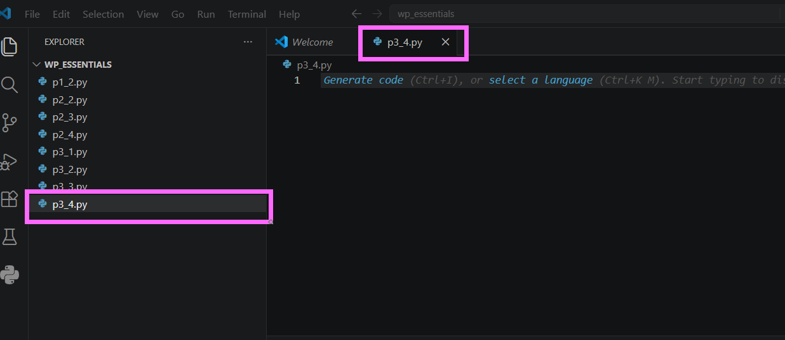
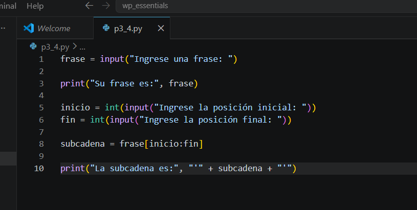
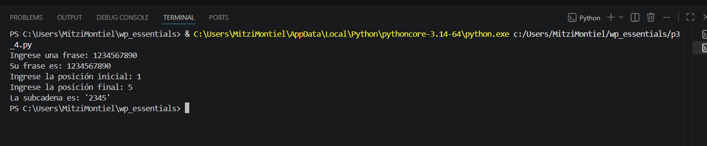
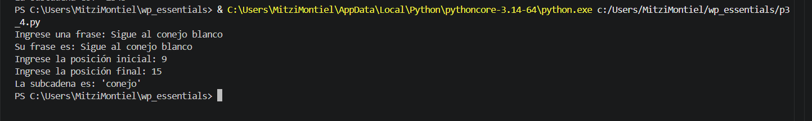

# Práctica 3.4. Corte de cadenas (Slicing)

## Objetivo de la práctica

Al finalizar esta práctica, serás capaz de:

- Utilizar la técnica de **slicing** para extraer subcadenas de una cadena de caracteres.
- Comprender cómo funcionan los índices de inicio y fin en un corte de cadenas.
- Construir programas que permitan al usuario obtener una parte específica de un texto.

---

# Objetivo visual

Durante esta práctica desarrollarás un programa que permitirá extraer una subcadena a partir de una frase y dos posiciones indicadas por el usuario.

```text
        Abrir Visual Studio Code
                   │
                   ▼
         Crear el archivo p3_4.py
                   │
                   ▼
      Capturar una frase
                   │
                   ▼
 Capturar posición inicial y final
                   │
                   ▼
      Aplicar slicing [inicio:fin]
                   │
                   ▼
      Mostrar la subcadena
                   │
                   ▼
      Analizar el resultado
```

---

## Duración aproximada

**8 minutos**

---

# Tabla de ayuda

| Recurso | Valor |
|---------|-------|
| Editor | Visual Studio Code |
| Lenguaje | Python 3 |
| Archivo | `p3_4.py` |
| Funciones utilizadas | `input()`, `print()`, `int()` |
| Operador utilizado | `[:]` (Slicing) |

---

# Instrucciones

## Tarea 1. Crear el programa

### Paso 1. Crear un nuevo archivo

Crear un archivo llamado:

```text
p3_4.py
```



---

### Paso 2. Escribir el siguiente código

Agregar el siguiente programa.

```python
frase = input("Ingrese una frase: ")

print("Su frase es:", frase)

inicio = int(input("Ingrese la posición inicial: "))
fin = int(input("Ingrese la posición final: "))

subcadena = frase[inicio:fin]

print("La subcadena es:", "'" + subcadena + "'")
```

Guardar el archivo.



---

## Tarea 2. Ejecutar el programa

### Paso 1. Probar con una cadena numérica

Ejecutar el programa utilizando el botón **Run Python File** o mediante la terminal.

```bash
python p3_4.py
```

Ingresar la siguiente información.

```text
Frase:
1234567890

Posición inicial:
1

Posición final:
5
```

Observar el resultado.



---

### Paso 2. Probar con una frase

Ejecutar nuevamente el programa.

Ingresar la siguiente información.

```text
Frase:
Sigue al conejo blanco

Posición inicial:
9

Posición final:
15
```

Observar la subcadena obtenida.




---

## Tarea 3. Experimentar con el slicing

Modificar únicamente los valores de inicio y fin para responder las siguientes preguntas.

1. ¿Qué ocurre si el índice inicial es **0**?

2. ¿Qué sucede si el índice final coincide con la longitud de la cadena?

3. ¿Qué ocurre si ambos índices son iguales?

4. ¿Qué sucede si el índice inicial es mayor que el índice final?

> **Nota:** En Python, el índice inicial se incluye en el resultado, mientras que el índice final **no se incluye**.

---

## Tarea 4. Analizar los resultados

Responder las siguientes preguntas.

1. ¿Cuál es la diferencia entre utilizar `frase[posicion]` y `frase[inicio:fin]`?

2. ¿Qué representa el índice inicial?

3. ¿Qué representa el índice final?

4. ¿Por qué el carácter ubicado en la posición final no aparece en la subcadena?

5. ¿Qué ventajas ofrece el uso de **slicing** al trabajar con cadenas de texto?

---

# Validación

Verifique que realizó correctamente las siguientes actividades.

| Actividad | Completado |
|------------|------------|
| Creó el archivo `p3_4.py` | ☐ |
| Capturó una frase | ☐ |
| Solicitó una posición inicial | ☐ |
| Solicitó una posición final | ☐ |
| Utilizó el operador de slicing `[:]` | ☐ |
| Extrajo correctamente una subcadena | ☐ |
| Respondió las preguntas de análisis | ☐ |

---

# Resultado esperado

Al finalizar la práctica el programa deberá permitir obtener una parte específica de una cadena utilizando una posición inicial y una posición final.

Ejemplo:

```text
Ingrese una frase:
1234567890

Ingrese la posición inicial:
1

Ingrese la posición final:
5

La subcadena es: '2345'
```

---

# Conclusión

Durante esta práctica aprendiste a utilizar el operador **slicing (`[:]`)** para extraer porciones de una cadena de caracteres. Comprobaste que el índice inicial sí forma parte de la subcadena, mientras que el índice final únicamente indica dónde termina el corte y no se incluye en el resultado.

El uso de slicing es una herramienta muy útil para manipular texto y será ampliamente utilizado en capítulos posteriores al trabajar con cadenas, listas y otras estructuras de datos.

---

# Conocimientos adquiridos

Al finalizar esta práctica aprendiste a:

- Utilizar el operador de slicing (`[:]`).
- Extraer subcadenas a partir de una posición inicial y final.
- Comprender que el índice final no forma parte del resultado.
- Diferenciar entre indexación y slicing.
- Manipular cadenas de caracteres de manera eficiente.