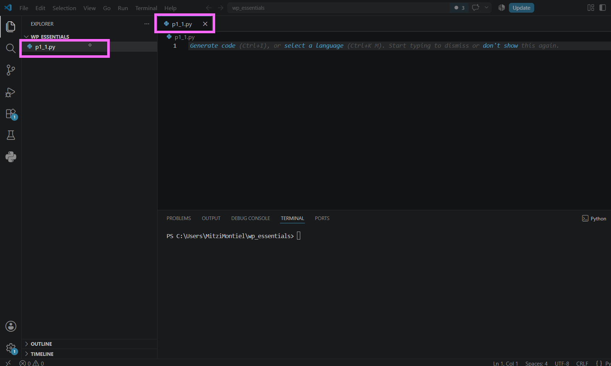
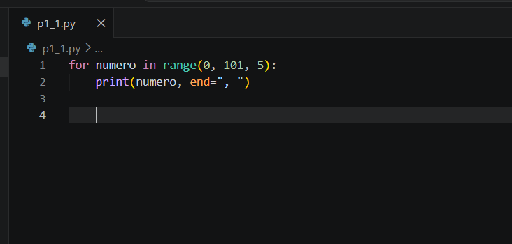
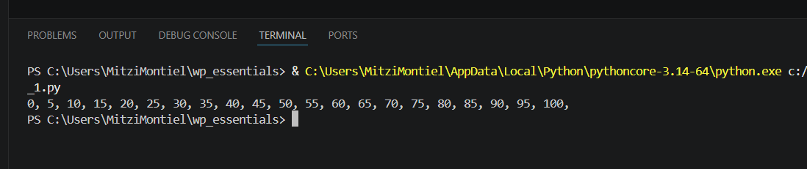
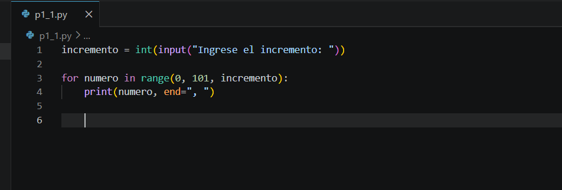
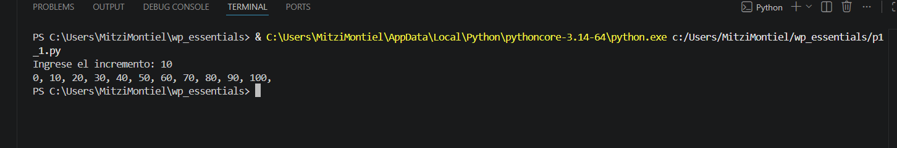

# Práctica 4.1. Rangos

## Objetivo de la práctica

Al finalizar esta práctica, serás capaz de:

- Utilizar la función `range()` para generar secuencias numéricas.
- Emplear ciclos `for` para recorrer rangos de valores.
- Construir programas que generen secuencias utilizando un incremento definido por el usuario.

---

# Objetivo visual

Durante esta práctica desarrollarás un programa que genere secuencias numéricas utilizando la función `range()`.

```text
        Abrir Visual Studio Code
                   │
                   ▼
         Crear el archivo p1_1.py
                   │
                   ▼
     Generar múltiplos de 5
                   │
                   ▼
      Mostrar la secuencia
                   │
                   ▼
 Solicitar un incremento al usuario
                   │
                   ▼
 Generar una nueva secuencia
                   │
                   ▼
      Analizar los resultados
```

---

## Duración aproximada

**8 minutos**

---

# Tabla de ayuda

| Recurso | Valor |
|---------|-------|
| Editor | Visual Studio Code |
| Lenguaje | Python 3 |
| Archivo | `p1_1.py` |
| Funciones utilizadas | `print()`, `input()`, `range()`, `int()` |
| Ciclo utilizado | `for` |

---

# Instrucciones

## Tarea 1. Mostrar los múltiplos de 5

### Paso 1. Crear un nuevo archivo

Crear un archivo llamado:

```text
p1_1.py
```



---

### Paso 2. Escribir el siguiente código

Agregar el siguiente programa.

```python
for numero in range(0, 101, 5):
    print(numero, end=", ")
```

Guardar el archivo.

> **Nota:** El parámetro `end=", "` permite mostrar todos los valores en una misma línea separados por coma y espacio.




---

### Paso 3. Ejecutar el programa

Ejecutar el archivo utilizando el botón **Run Python File** o mediante la terminal.

```bash
python p4_1.py
```

Verificar que la salida sea similar a la siguiente:

```text
0, 5, 10, 15, 20, 25, ...
```



---

## Tarea 2. Permitir que el usuario defina el incremento

### Paso 1. Modificar el programa

Reemplazar el código anterior por el siguiente.

```python
incremento = int(input("Ingrese el incremento: "))

for numero in range(0, 101, incremento):
    print(numero, end=", ")
```

Guardar el archivo.



---

### Paso 2. Ejecutar el programa

Ejecutar nuevamente el programa.

Cuando el sistema lo solicite, ingresar el valor:

```text
10
```

Observar la salida obtenida.

```text
0, 10, 20, 30, 40, 50, 60, 70, 80, 90, 100
```




---

### Paso 3. Experimentar con diferentes incrementos

Ejecutar nuevamente el programa utilizando distintos valores de incremento.

Por ejemplo:

- 2
- 4
- 8
- 20

Responder:

- ¿Qué sucede cuando el incremento es menor?
- ¿Qué ocurre cuando el incremento es mayor?

> **Desafío:** ¿Qué ocurre si el usuario ingresa el valor **0** como incremento? Analice el mensaje mostrado por Python.

---

## Tarea 3. Analizar el uso de `range()`

Responder las siguientes preguntas.

1. ¿Cuántos parámetros puede recibir la función `range()`?

2. ¿Qué representa el primer parámetro?

3. ¿Qué representa el segundo parámetro?

4. ¿Qué representa el tercer parámetro?

5. ¿Por qué el número **101** fue utilizado como límite superior en lugar de **100**?

---

# Validación

Verifique que realizó correctamente las siguientes actividades.

| Actividad | Completado |
|------------|------------|
| Creó el archivo `p4_1.py` | ☐ |
| Utilizó la función `range()` | ☐ |
| Utilizó un ciclo `for` | ☐ |
| Mostró los múltiplos de 5 | ☐ |
| Solicitó un incremento al usuario | ☐ |
| Generó nuevas secuencias utilizando diferentes incrementos | ☐ |
| Respondió las preguntas de análisis | ☐ |

---

# Resultado esperado

Al finalizar la práctica el programa deberá generar una secuencia numérica utilizando la función `range()`.

Ejemplo:

```text
Ingrese el incremento:
10

0, 10, 20, 30, 40, 50, 60, 70, 80, 90, 100
```
---

# Conclusión

En esta práctica aprendiste a utilizar la función `range()` para generar secuencias numéricas y recorriste dichas secuencias mediante un ciclo `for`. También comprobaste cómo el tercer parámetro de `range()` controla el incremento entre cada elemento de la secuencia.

El uso de `range()` simplifica la generación de secuencias y evita tener que incrementar manualmente una variable dentro de un ciclo.

---

# Conocimientos adquiridos

Al finalizar esta práctica aprendiste a:

- Utilizar la función `range()`.
- Recorrer secuencias mediante ciclos `for`.
- Generar múltiplos de un número.
- Solicitar datos al usuario mediante `input()`.
- Construir secuencias con incrementos personalizados.
- Comprender el funcionamiento de los parámetros de `range()`.

