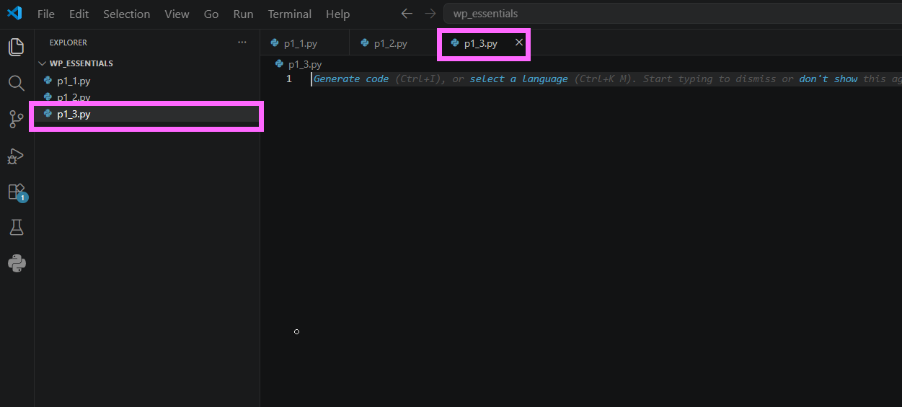
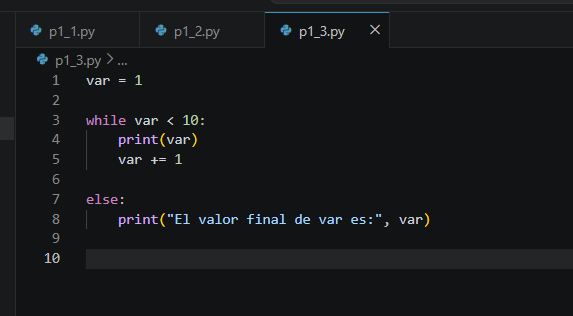
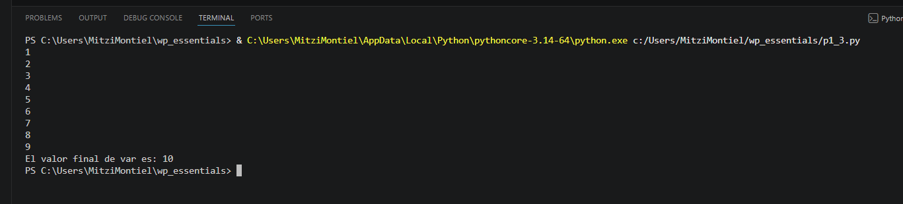
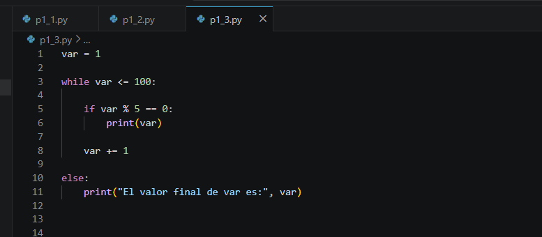
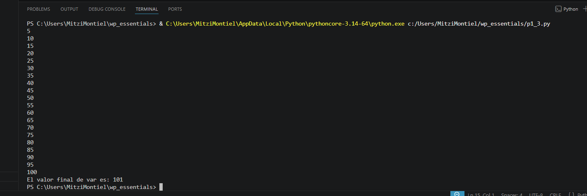
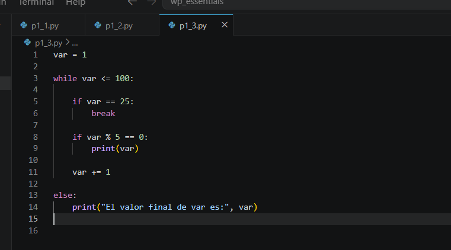
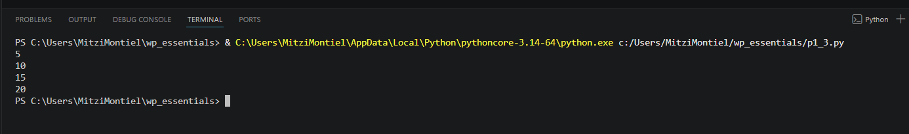

# Práctica 4.3. Control de flujo

## Objetivo de la práctica

Al finalizar esta práctica, serás capaz de:

- Comprender el funcionamiento de la cláusula `else` asociada a un ciclo `while`.
- Identificar cuándo se ejecuta el bloque `else` y cuándo no.
- Analizar el efecto de la instrucción `break` sobre la ejecución del ciclo.

---

# Objetivo visual

Durante esta práctica desarrollarás un programa que recorrerá una secuencia de números utilizando un ciclo `while` y observarás el comportamiento de la cláusula `else`.

```text
        Abrir Visual Studio Code
                   │
                   ▼
         Crear el archivo p1_3.py
                   │
                   ▼
        Ejecutar un ciclo while
                   │
                   ▼
     ¿El ciclo terminó normalmente?
           │                │
          Sí               No (break)
           │                │
           ▼                ▼
 Ejecutar el bloque else   No ejecutar else
                   │
                   ▼
      Analizar el comportamiento
```

---

## Duración aproximada

**8 minutos**

---

# Tabla de ayuda

| Recurso | Valor |
|---------|-------|
| Editor | Visual Studio Code |
| Lenguaje | Python 3 |
| Archivo | `p1_3.py` |
| Estructuras utilizadas | `while`, `if`, `break`, `else` |

---

# Instrucciones

## Tarea 1. Comprender el funcionamiento de `while...else`

### Paso 1. Crear un nuevo archivo

Crear un archivo llamado:

```text
p1_3.py
```


---

### Paso 2. Escribir el siguiente código

Agregar el siguiente programa.

```python
var = 1

while var < 10:
    print(var)
    var += 1

else:
    print("El valor final de var es:", var)
```

Guardar el archivo.



---

### Paso 3. Ejecutar el programa

Ejecutar el archivo.

```bash
python p1_3.py
```

Observar que el mensaje del bloque `else` se muestra al finalizar el ciclo.



---

## Tarea 2. Mostrar únicamente los múltiplos de 5

### Paso 1. Modificar el código

Actualizar el programa para que únicamente muestre los múltiplos de 5.

```python
var = 1

while var <= 100:

    if var % 5 == 0:
        print(var)

    var += 1

else:
    print("El valor final de var es:", var)
```

Guardar el archivo.




---

### Paso 2. Ejecutar nuevamente

Verificar que únicamente se impriman los múltiplos de 5 y que el mensaje del `else` continúe apareciendo.



---

## Tarea 3. Interrumpir el ciclo utilizando `break`

### Paso 1. Agregar una condición de salida

Modificar el programa para detener el ciclo cuando `var` sea igual a **25**.

```python
var = 1

while var <= 100:

    if var == 25:
        break

    if var % 5 == 0:
        print(var)

    var += 1

else:
    print("El valor final de var es:", var)
```

Guardar el archivo.

> **Nota:** La instrucción `break` finaliza inmediatamente el ciclo, por lo que el bloque `else` no se ejecutará.




---

### Paso 2. Ejecutar el programa

Observar cuidadosamente el resultado.

Responder:

- ¿Se ejecutó el bloque `else`?
- ¿Por qué ocurrió ese comportamiento?



---

## Tarea 4. Analizar el comportamiento del ciclo

Responder las siguientes preguntas.

1. ¿Cuándo se ejecuta el bloque `else` de un ciclo `while`?

2. ¿Qué efecto tiene la instrucción `break`?

3. ¿Qué diferencia observó entre la primera ejecución y la última?

4. ¿En qué tipo de programas considera útil utilizar `while...else`?

---

# Validación

Verifique que realizó correctamente las siguientes actividades.

| Actividad | Completado |
|------------|------------|
| Creó el archivo `p1_3.py` | ☐ |
| Implementó un ciclo `while` | ☐ |
| Utilizó la cláusula `else` | ☐ |
| Mostró únicamente los múltiplos de 5 | ☐ |
| Utilizó la instrucción `break` | ☐ |
| Analizó cuándo se ejecuta el bloque `else` | ☐ |

---

# Resultado esperado

Al finalizar la práctica el participante comprenderá que el bloque `else` únicamente se ejecuta cuando el ciclo termina de forma natural y que no se ejecuta cuando el ciclo finaliza mediante la instrucción `break`.


---

# Conclusión

En esta práctica comprobaste el funcionamiento de la cláusula `else` asociada a un ciclo `while`. Observaste que este bloque se ejecuta únicamente cuando el ciclo concluye de forma normal y que la instrucción `break` interrumpe el ciclo antes de que el bloque `else` pueda ejecutarse.

Este comportamiento resulta muy útil cuando se desea realizar una acción únicamente si el ciclo terminó correctamente y no fue interrumpido.

---

# Conocimientos adquiridos

Al finalizar esta práctica aprendiste a:

- Utilizar ciclos `while`.
- Implementar la cláusula `else` en un ciclo.
- Utilizar la instrucción `break`.
- Comprender cuándo se ejecuta el bloque `else`.
- Controlar el flujo de ejecución de un programa.