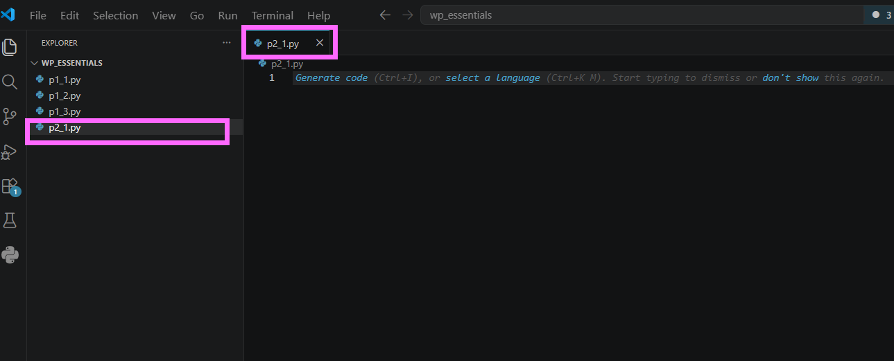
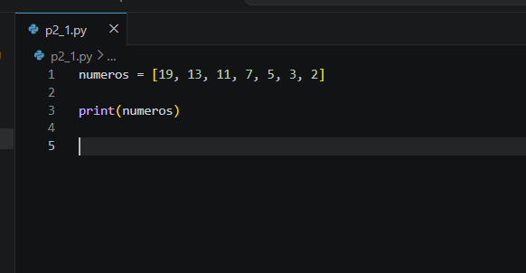
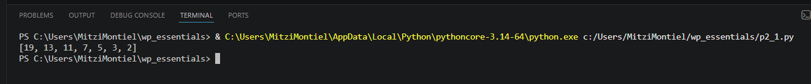
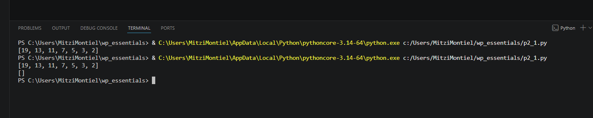
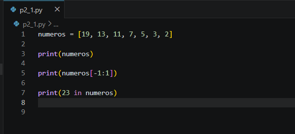
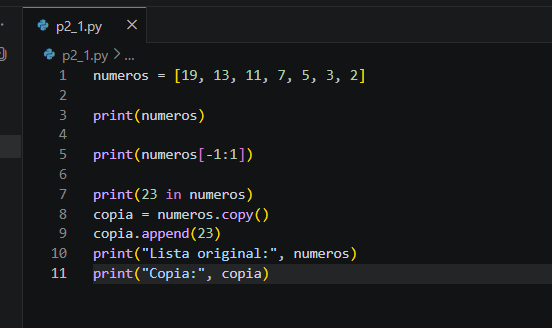
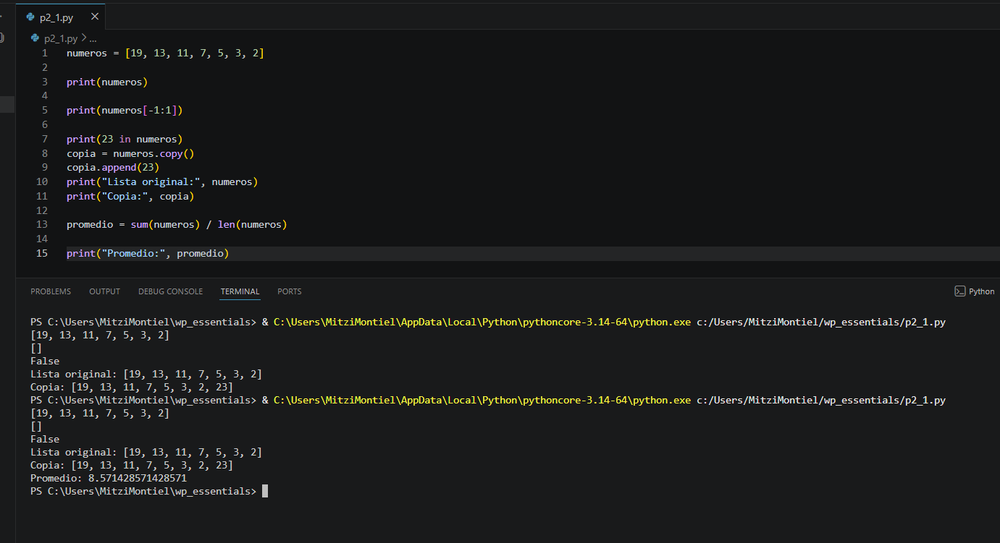
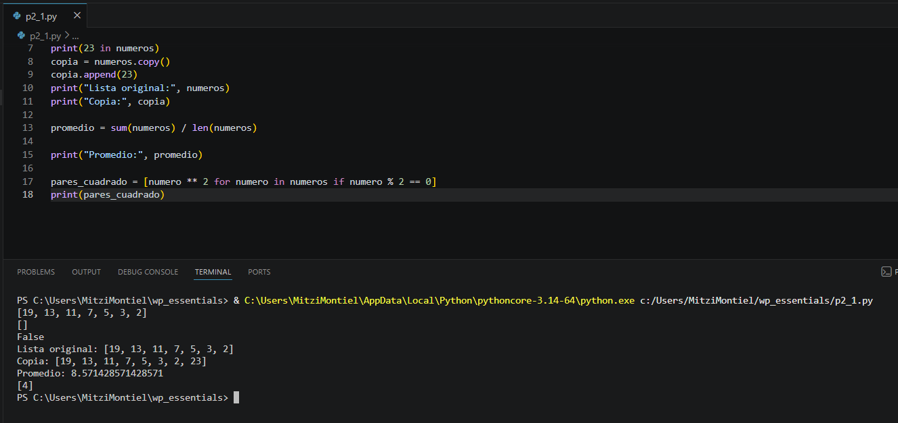

# Práctica 5.1. Listas y comprensión de listas

## Objetivo de la práctica

Al finalizar esta práctica, serás capaz de:

- Crear y manipular listas en Python.
- Realizar operaciones de acceso, búsqueda y copia de listas.
- Generar nuevas listas mediante **List Comprehension**.
- Aplicar operaciones matemáticas sobre los elementos de una lista.

---

# Objetivo visual

Durante esta práctica crearás una lista, realizarás diferentes operaciones sobre ella y generarás una nueva lista utilizando comprensión de listas.

```text
        Abrir Visual Studio Code
                   │
                   ▼
         Crear el archivo p2_1.py
                   │
                   ▼
          Crear una lista
                   │
                   ▼
      Acceder y consultar datos
                   │
                   ▼
          Copiar la lista
                   │
                   ▼
       Agregar nuevos elementos
                   │
                   ▼
      Calcular el promedio
                   │
                   ▼
     Crear una nueva lista con
      comprensión de listas
```

---

## Duración aproximada

**8 minutos**

---

# Tabla de ayuda

| Recurso | Valor |
|---------|-------|
| Editor | Visual Studio Code |
| Lenguaje | Python 3 |
| Archivo | `p2_1.py` |
| Funciones utilizadas | `print()`, `sum()`, `len()` |
| Métodos utilizados | `copy()`, `append()` |

---

# Instrucciones

## Tarea 1. Crear una lista

### Paso 1. Crear un nuevo archivo

Crear un archivo llamado:

```text
p2_1.py
```

**Captura esperada**



---

### Paso 2. Crear la lista

Escribir el siguiente código.

```python
numeros = [19, 13, 11, 7, 5, 3, 2]

print(numeros)
```

Guardar el archivo.



---

### Paso 3. Ejecutar el programa

Ejecutar el archivo.

```bash
python p2_1.py
```

Verificar que la lista se muestre correctamente.



---

## Tarea 2. Explorar la lista

### Paso 1. Verificar un corte de la lista

Agregar la siguiente instrucción.

```python
print(numeros[-1:1])
```

Responder:

- ¿Qué resultado obtiene?
- ¿Por qué la lista está vacía?

> **Nota:** El corte comienza en el último elemento y termina antes de la posición 1. Como el recorrido es hacia adelante y el índice inicial es mayor que el final, el resultado es una lista vacía.




---

### Paso 2. Verificar si un elemento existe

Agregar la siguiente instrucción.

```python
print(23 in numeros)
```

Responder:

- ¿Qué valor devuelve el operador `in`?




---

## Tarea 3. Copiar y modificar una lista

### Paso 1. Crear una copia

Agregar el siguiente código.

```python
copia = numeros.copy()
```

Después agregar:

```python
copia.append(23)
```

Finalmente imprimir ambas listas.

```python
print("Lista original:", numeros)
print("Copia:", copia)
```

Responder:

- ¿La lista original cambió?



---

## Tarea 4. Calcular el promedio

Agregar el siguiente código.

```python
promedio = sum(numeros) / len(numeros)

print("Promedio:", promedio)
```

Ejecutar nuevamente.




---

## Tarea 5. Utilizar comprensión de listas

Agregar el siguiente código.

```python
pares_cuadrado = [numero ** 2 for numero in numeros if numero % 2 == 0]

print(pares_cuadrado)
```

Responder:

- ¿Qué elementos fueron seleccionados?
- ¿Qué operación realiza la comprensión de listas?

> **Nota:** Una **List Comprehension** permite crear una nueva lista en una sola expresión utilizando un recorrido y una condición opcional.



---

## Tarea 6. Analizar los resultados

Responder las siguientes preguntas.

1. ¿Qué diferencia existe entre una lista original y una copia?

2. ¿Qué hace el método `append()`?

3. ¿Para qué sirve el método `copy()`?

4. ¿Qué ventaja ofrece una comprensión de listas respecto a un ciclo tradicional?

5. ¿Qué función cumple la condición `if numero % 2 == 0`?

---

# Validación

Verifique que realizó correctamente las siguientes actividades.

| Actividad | Completado |
|------------|------------|
| Creó el archivo `p2_1.py` | ☐ |
| Creó una lista | ☐ |
| Utilizó el operador `in` | ☐ |
| Realizó un corte (slicing) | ☐ |
| Copió una lista mediante `copy()` | ☐ |
| Agregó un elemento con `append()` | ☐ |
| Calculó el promedio | ☐ |
| Creó una lista mediante comprensión de listas | ☐ |

---

# Resultado esperado

Al finalizar la práctica el programa deberá:

- Mostrar la lista original.
- Verificar la existencia de un elemento.
- Crear una copia independiente.
- Calcular el promedio.
- Generar una nueva lista con los números pares elevados al cuadrado.

Ejemplo de salida:

```text
[19, 13, 11, 7, 5, 3, 2]

[]

False

Lista original: [19, 13, 11, 7, 5, 3, 2]

Copia: [19, 13, 11, 7, 5, 3, 2, 23]

Promedio: 8.57

[4]
```
---

# Conclusión

En esta práctica aprendiste a trabajar con listas en Python realizando operaciones de creación, búsqueda, copia y modificación. También utilizaste funciones integradas para calcular el promedio de los elementos y conociste una de las características más poderosas del lenguaje: las **List Comprehensions**, que permiten generar nuevas listas de forma clara, compacta y eficiente.

---

# Conocimientos adquiridos

Al finalizar esta práctica aprendiste a:

- Crear listas.
- Acceder a elementos mediante slicing.
- Buscar elementos utilizando el operador `in`.
- Copiar listas mediante `copy()`.
- Agregar elementos con `append()`.
- Calcular promedios utilizando `sum()` y `len()`.
- Crear nuevas listas mediante **List Comprehension**.

