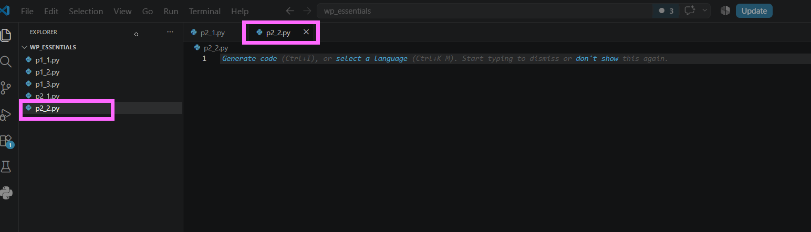
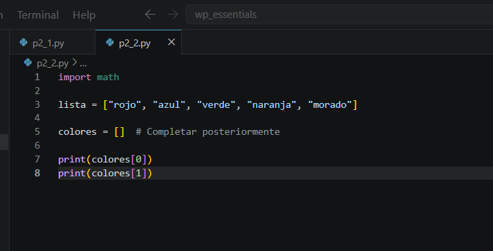
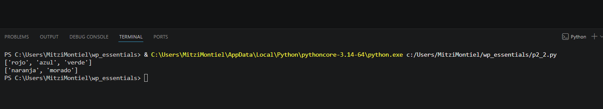
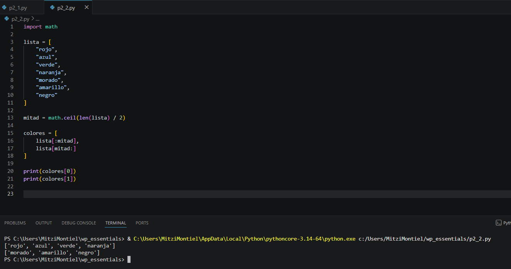

# Práctica 5.2. Slicing de listas

## Objetivo de la práctica

Al finalizar esta práctica, serás capaz de:

- Utilizar la técnica de **slicing** para dividir listas en sublistas.
- Comprender cómo funcionan los índices al realizar cortes sobre una lista.
- Aplicar la función `math.ceil()` para calcular el punto medio de una lista cuando el número de elementos es impar.

---

# Objetivo visual

Durante esta práctica desarrollarás un programa que dividirá una lista en dos partes utilizando slicing.

```text
        Abrir Visual Studio Code
                   │
                   ▼
         Crear el archivo p2_2.py
                   │
                   ▼
        Crear una lista
                   │
                   ▼
      Calcular el punto medio
                   │
                   ▼
      Aplicar slicing [:] 
                   │
                   ▼
     Obtener dos sublistas
                   │
                   ▼
      Mostrar los resultados
```

---

## Duración aproximada

**8 minutos**

---

# Tabla de ayuda

| Recurso | Valor |
|---------|-------|
| Editor | Visual Studio Code |
| Lenguaje | Python 3 |
| Archivo | `p2_2.py` |
| Módulo | `math` |
| Funciones utilizadas | `len()`, `math.ceil()`, `print()` |

---

# Instrucciones

## Tarea 1. Crear el programa

### Paso 1. Crear un nuevo archivo

Crear un archivo llamado:

```text
p2_2.py
```




---

### Paso 2. Escribir el código inicial

Agregar el siguiente código.

```python
import math

lista = ["rojo", "azul", "verde", "naranja", "morado"]

colores = []  # Completar posteriormente

print(colores[0])
print(colores[1])
```

Guardar el archivo.




---

## Tarea 2. Dividir la lista utilizando slicing

### Paso 1. Calcular el punto medio

Antes de crear la variable `colores`, agregar la siguiente instrucción.

```python
mitad = math.ceil(len(lista) / 2)
```

> **Nota:** La función `math.ceil()` redondea hacia arriba. Esto permite que la primera sublista tenga un elemento adicional cuando la cantidad de elementos es impar.

---

### Paso 2. Crear las sublistas

Reemplazar la línea:

```python
colores = []
```

por:

```python
colores = [
    lista[:mitad],
    lista[mitad:]
]
```

Guardar el archivo.


---

## Tarea 3. Ejecutar el programa

### Paso 1. Ejecutar el archivo

Ejecutar el programa.

```bash
python p2_2.py
```

Observar la salida.

```text
['rojo', 'azul', 'verde']

['naranja', 'morado']
```


---

## Tarea 4. Experimentar con la lista

Modificar la lista original agregando nuevos colores.

Por ejemplo:

```python
lista = [
    "rojo",
    "azul",
    "verde",
    "naranja",
    "morado",
    "amarillo",
    "negro"
]
```

Ejecutar nuevamente.

Responder:

- ¿Cómo cambió el contenido de las dos sublistas?
- ¿Cuál contiene más elementos?
- ¿Por qué fue necesario utilizar `math.ceil()`?



---

## Tarea 5. Analizar los resultados

Responder las siguientes preguntas.

1. ¿Qué hace el operador de slicing `[:]`?

2. ¿Qué representa la variable `mitad`?

3. ¿Por qué se utilizó `math.ceil()` en lugar de una división normal?

4. ¿Qué ocurre si la lista tiene un número par de elementos?

5. ¿Qué ventajas ofrece dividir una lista mediante slicing?

---

# Validación

Verifique que realizó correctamente las siguientes actividades.

| Actividad | Completado |
|------------|------------|
| Creó el archivo `p2_2.py` | ☐ |
| Importó el módulo `math` | ☐ |
| Calculó el punto medio de la lista | ☐ |
| Utilizó slicing para dividir la lista | ☐ |
| Obtuvo dos sublistas | ☐ |
| Probó el programa con una lista diferente | ☐ |

---

# Resultado esperado

Al finalizar la práctica el programa deberá mostrar dos listas independientes.

Ejemplo:

```text
['rojo', 'azul', 'verde']

['naranja', 'morado']
```
y con la nueva lista debe salir:

```text
['rojo', 'azul', 'verde', 'naranja']

['morado', 'amarillo', 'negro']
```

---

# Conclusión

En esta práctica aprendiste a dividir una lista en dos partes utilizando la técnica de **slicing**. También comprobaste cómo la función `math.ceil()` permite obtener un punto medio adecuado cuando la cantidad de elementos es impar, garantizando que la primera sublista contenga el elemento adicional.

El uso de slicing es una técnica ampliamente utilizada para manipular colecciones de datos de forma sencilla y eficiente.

---

# Conocimientos adquiridos

Al finalizar esta práctica aprendiste a:

- Importar módulos de Python.
- Utilizar la función `math.ceil()`.
- Obtener la longitud de una lista mediante `len()`.
- Dividir listas utilizando slicing.
- Crear listas que contienen otras listas.
- Comprender cómo se realizan los cortes sobre colecciones.

