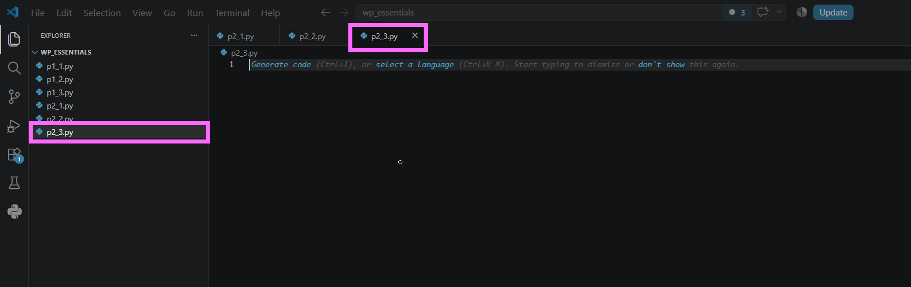
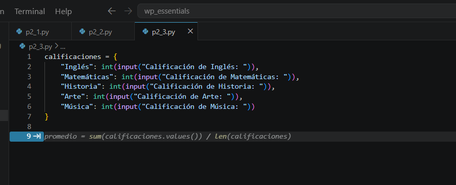
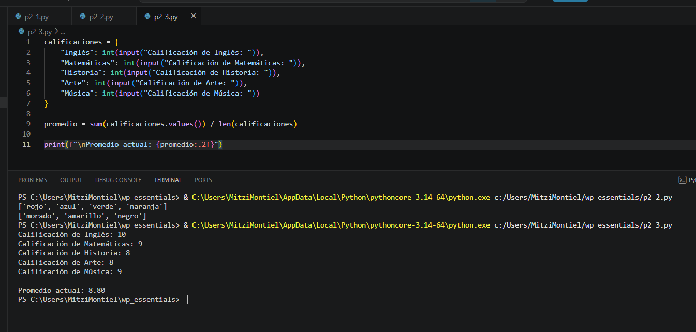
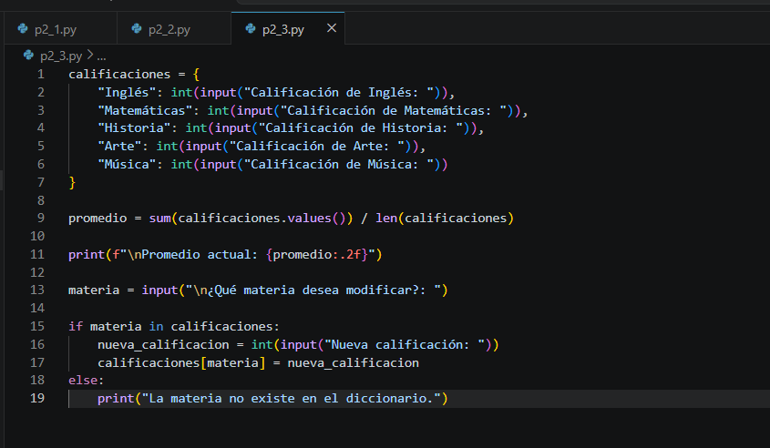
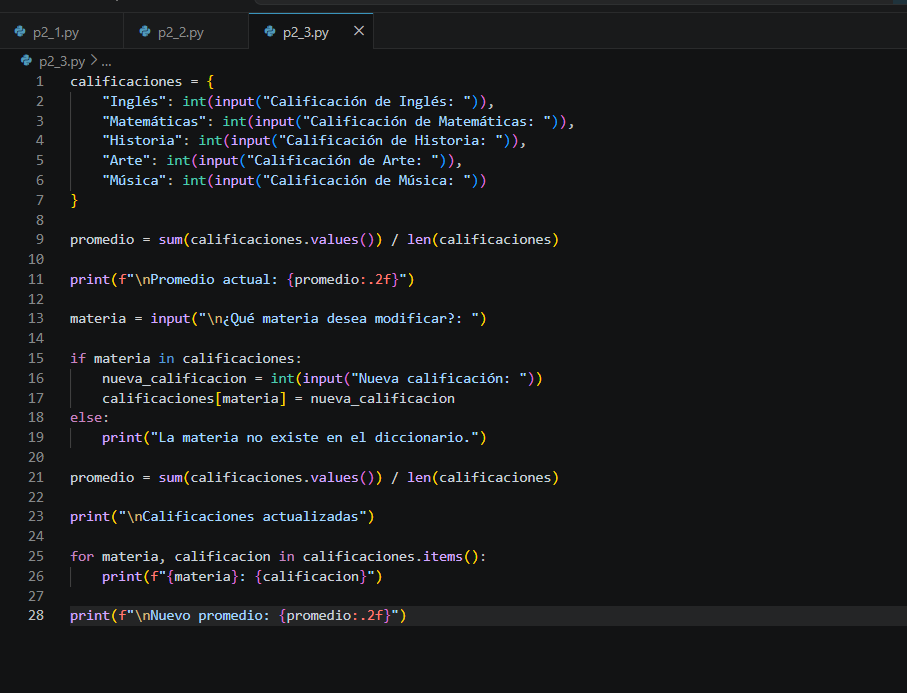
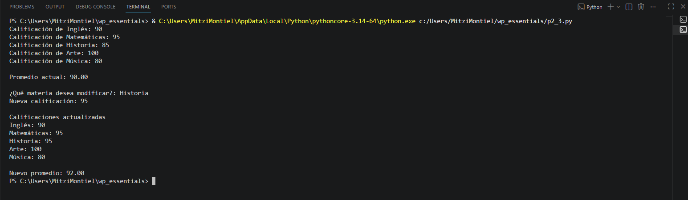

# Práctica 5.3. Diccionarios

## Objetivo de la práctica

Al finalizar esta práctica, serás capaz de:

- Crear y utilizar diccionarios en Python para almacenar información mediante pares **clave-valor**.
- Capturar datos ingresados por el usuario y almacenarlos en un diccionario.
- Acceder y modificar valores existentes en un diccionario.
- Calcular el promedio de las calificaciones almacenadas.

---

# Objetivo visual

Durante esta práctica desarrollarás un programa que almacenará calificaciones en un diccionario, calculará el promedio y permitirá modificar una materia para recalcular el resultado.

```text
        Abrir Visual Studio Code
                   │
                   ▼
         Crear el archivo p2_3.py
                   │
                   ▼
     Capturar las calificaciones
                   │
                   ▼
      Guardarlas en un diccionario
                   │
                   ▼
      Calcular el promedio
                   │
                   ▼
   Modificar una calificación
                   │
                   ▼
     Calcular el nuevo promedio
```

---

## Duración aproximada

**8 minutos**

---

# Tabla de ayuda

| Recurso | Valor |
|---------|-------|
| Editor | Visual Studio Code |
| Lenguaje | Python 3 |
| Archivo | `p2_3.py` |
| Estructura | Diccionario (`dict`) |
| Funciones utilizadas | `input()`, `int()`, `sum()`, `len()`, `print()` |

---

# Instrucciones

## Tarea 1. Crear el programa

### Paso 1. Crear un nuevo archivo

Crear un archivo llamado:

```text
p2_3.py
```


---

### Paso 2. Capturar las calificaciones

Agregar el siguiente código.

```python
calificaciones = {
    "Inglés": int(input("Calificación de Inglés: ")),
    "Matemáticas": int(input("Calificación de Matemáticas: ")),
    "Historia": int(input("Calificación de Historia: ")),
    "Arte": int(input("Calificación de Arte: ")),
    "Música": int(input("Calificación de Música: "))
}
```

Guardar el archivo.

> **Nota:** Se utiliza la función `int()` para convertir las entradas del usuario en valores numéricos enteros.



---

## Tarea 2. Calcular el promedio

### Paso 1. Obtener el promedio

Agregar el siguiente código.

```python
promedio = sum(calificaciones.values()) / len(calificaciones)

print(f"\nPromedio actual: {promedio:.2f}")
```

Ejecutar el programa y verificar el resultado.



---

## Tarea 3. Modificar una calificación

### Paso 1. Solicitar la materia a modificar

Agregar el siguiente código.

```python
materia = input("\n¿Qué materia desea modificar?: ")
```

---

### Paso 2. Actualizar la calificación

Agregar el siguiente código.

```python
if materia in calificaciones:
    nueva_calificacion = int(input("Nueva calificación: "))
    calificaciones[materia] = nueva_calificacion
else:
    print("La materia no existe en el diccionario.")
```

> **Nota:** Antes de modificar un valor se verifica que la clave exista utilizando el operador `in`.



---

## Tarea 4. Calcular el nuevo promedio

Agregar el siguiente código.

```python
promedio = sum(calificaciones.values()) / len(calificaciones)

print("\nCalificaciones actualizadas")

for materia, calificacion in calificaciones.items():
    print(f"{materia}: {calificacion}")

print(f"\nNuevo promedio: {promedio:.2f}")
```

Ejecutar nuevamente el programa.



---

## Tarea 5. Analizar los resultados

Responder las siguientes preguntas.

1. ¿Qué representa la clave y el valor dentro de un diccionario?

2. ¿Por qué fue necesario convertir las entradas con `int()`?

3. ¿Qué hace el método `values()`?

4. ¿Qué devuelve el método `items()`?

5. ¿Qué ventaja ofrece un diccionario respecto a una lista para este problema?

---

# Validación

Verifique que realizó correctamente las siguientes actividades.

| Actividad | Completado |
|------------|------------|
| Creó el archivo `p2_3.py` | ☐ |
| Capturó las cinco calificaciones | ☐ |
| Almacenó la información en un diccionario | ☐ |
| Calculó el promedio | ☐ |
| Modificó una calificación | ☐ |
| Calculó nuevamente el promedio | ☐ |

---

# Resultado esperado

Al finalizar la práctica el programa deberá permitir capturar las calificaciones, mostrar el promedio, modificar una materia y recalcular el promedio.

Ejemplo de ejecución:

```text
Calificación de Inglés: 90
Calificación de Matemáticas: 95
Calificación de Historia: 85
Calificación de Arte: 100
Calificación de Música: 80

Promedio actual: 90.00

¿Qué materia desea modificar?: Historia

Nueva calificación: 95

Calificaciones actualizadas

Inglés: 90
Matemáticas: 95
Historia: 95
Arte: 100
Música: 80

Nuevo promedio: 92.00
```



---

# Conclusión

En esta práctica aprendiste a utilizar diccionarios para almacenar información mediante pares **clave-valor**. También calculaste el promedio de las calificaciones utilizando las funciones `sum()` y `len()`, modificaste un elemento del diccionario y comprobaste cómo los cambios se reflejan inmediatamente al volver a procesar los datos.

---

# Conocimientos adquiridos

Al finalizar esta práctica aprendiste a:

- Crear diccionarios.
- Agregar información mediante claves y valores.
- Acceder y modificar elementos de un diccionario.
- Utilizar los métodos `values()` e `items()`.
- Recorrer un diccionario con un ciclo `for`.
- Calcular promedios utilizando la información almacenada en un diccionario.