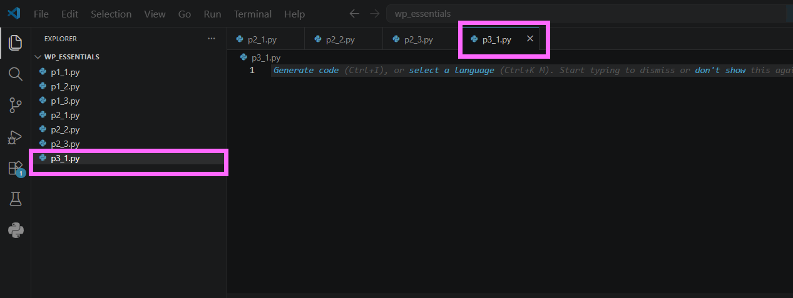
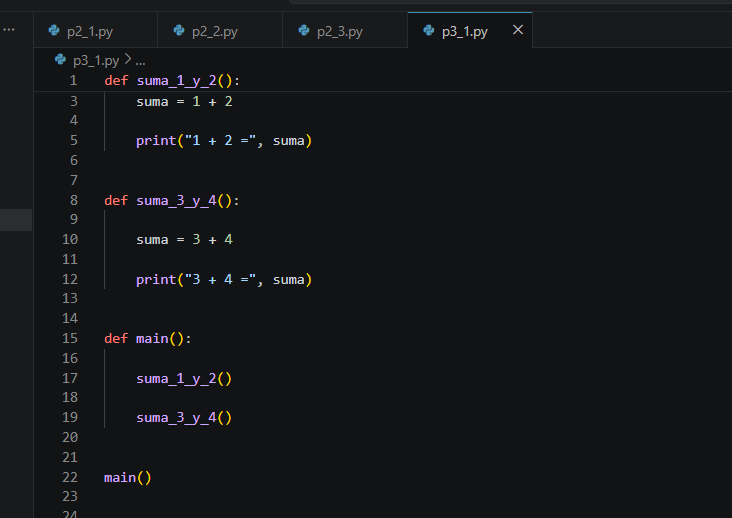
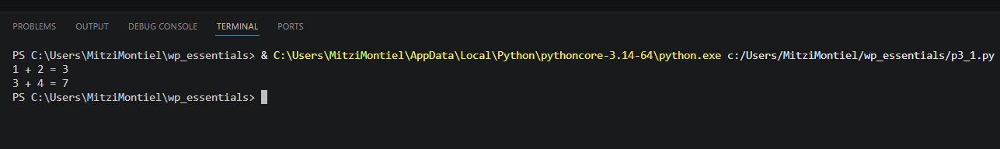
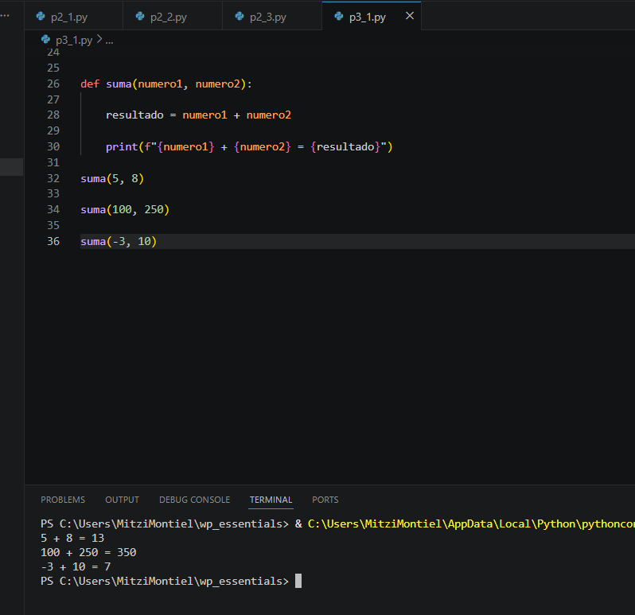
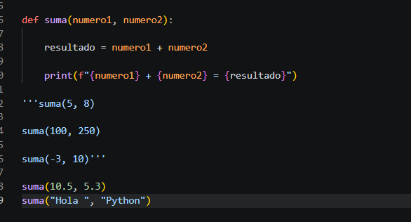
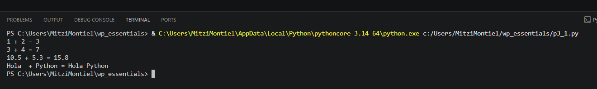

# Práctica 6.1. Funciones y parámetros

## Objetivo de la práctica

Al finalizar esta práctica, serás capaz de:

- Comprender la diferencia entre **parámetros** y **argumentos** en una función.
- Crear funciones reutilizables en Python.
- Invocar funciones enviando diferentes argumentos.
- Analizar el comportamiento de una función al recibir distintos tipos de datos.

---

# Objetivo visual

Durante esta práctica crearás funciones, las ejecutarás con diferentes argumentos y observarás cómo cambia su comportamiento.

```text
        Abrir Visual Studio Code
                   │
                   ▼
         Crear el archivo p3_1.py
                   │
                   ▼
      Definir funciones
                   │
                   ▼
      Crear la función main()
                   │
                   ▼
      Ejecutar el programa
                   │
                   ▼
      Crear una función con parámetros
                   │
                   ▼
      Invocar la función con
      distintos argumentos
```


---

## Duración aproximada

**8 minutos**

---

# Tabla de ayuda

| Recurso | Valor |
|---------|-------|
| Editor | Visual Studio Code |
| Lenguaje | Python 3 |
| Archivo | `p3_1.py` |
| Conceptos | Funciones, parámetros, argumentos |
| Funciones utilizadas | `print()` |

---

# Instrucciones

## Tarea 1. Analizar funciones sin parámetros

### Paso 1. Crear un nuevo archivo

Crear un archivo llamado:

```text
p3_1.py
```


---

### Paso 2. Escribir el código inicial

Agregar el siguiente código.

```python
def suma_1_y_2():

    suma = 1 + 2

    print("1 + 2 =", suma)


def suma_3_y_4():

    suma = 3 + 4

    print("3 + 4 =", suma)


def main():

    suma_1_y_2()

    suma_3_y_4()


main()
```

Guardar el archivo.



---

### Paso 3. Ejecutar el programa

Ejecutar el archivo.

```bash
python p3_1.py
```

Observar la salida.

Responder:

- ¿Qué ventaja tiene utilizar funciones?



---

## Tarea 2. Comprender parámetros y argumentos

Antes de continuar, responder la siguiente pregunta.

> **¿Cuál es la diferencia entre un parámetro y un argumento?**

> **Nota:** Un **parámetro** es la variable definida en la función. Un **argumento** es el valor que se envía al llamar a la función.

---

## Tarea 3. Crear una función con parámetros

### Paso 1. Agregar una nueva función

Debajo del código anterior agregar la siguiente función.

```python
def suma(numero1, numero2):

    resultado = numero1 + numero2

    print(f"{numero1} + {numero2} = {resultado}")
```

---

### Paso 2. Invocar la función

Agregar las siguientes llamadas.

```python
suma(5, 8)

suma(100, 250)

suma(-3, 10)
```

Ejecutar nuevamente el programa.

Responder:

- ¿Cuántas funciones diferentes fueron necesarias para realizar todas las sumas?



---

## Tarea 4. Experimentar con diferentes argumentos

Modificar las llamadas anteriores y probar los siguientes casos.

```python
suma(10.5, 5.3)
```

Después probar.

```python
suma("Hola ", "Python")
```

Responder:

- ¿Qué ocurrió en cada caso?
- ¿La función tuvo que modificarse?

> **Nota:** En Python el operador `+` puede realizar una suma entre números o una concatenación entre cadenas.



---

## Tarea 5. Analizar los resultados

Responder las siguientes preguntas.

1. ¿Qué diferencia existe entre una función con parámetros y una función sin parámetros?

2. ¿Qué son los argumentos?

3. ¿Qué ventaja tiene reutilizar una función?

4. ¿Por qué no fue necesario crear una función distinta para cada suma?

5. ¿Qué ocurrió cuando se enviaron cadenas de caracteres?

---

# Validación

Verifique que realizó correctamente las siguientes actividades.

| Actividad | Completado |
|------------|------------|
| Creó el archivo `p3_1.py` | ☐ |
| Ejecutó funciones sin parámetros | ☐ |
| Creó una función con parámetros | ☐ |
| Invocó la función con distintos argumentos | ☐ |
| Probó la función con números enteros | ☐ |
| Probó la función con números decimales | ☐ |
| Probó la función con cadenas | ☐ |

---

# Resultado esperado

Al finalizar la práctica el programa deberá producir una salida similar a la siguiente.

```text
1 + 2 = 3

3 + 4 = 7

5 + 8 = 13

100 + 250 = 350

-3 + 10 = 7

10.5 + 5.3 = 15.8

Hola Python
```




---

# Conclusión

En esta práctica aprendiste que las funciones permiten reutilizar código y hacerlo más fácil de mantener. También comprendiste la diferencia entre **parámetros**, que son las variables definidas por la función, y **argumentos**, que son los valores enviados durante la llamada.

Además, comprobaste que una misma función puede trabajar con diferentes tipos de datos, aprovechando el tipado dinámico de Python.

---

# Conocimientos adquiridos

Al finalizar esta práctica aprendiste a:

- Definir funciones.
- Invocar funciones.
- Utilizar parámetros.
- Enviar argumentos.
- Reutilizar código.
- Comprender la diferencia entre parámetros y argumentos.
- Utilizar una misma función con distintos tipos de datos.
