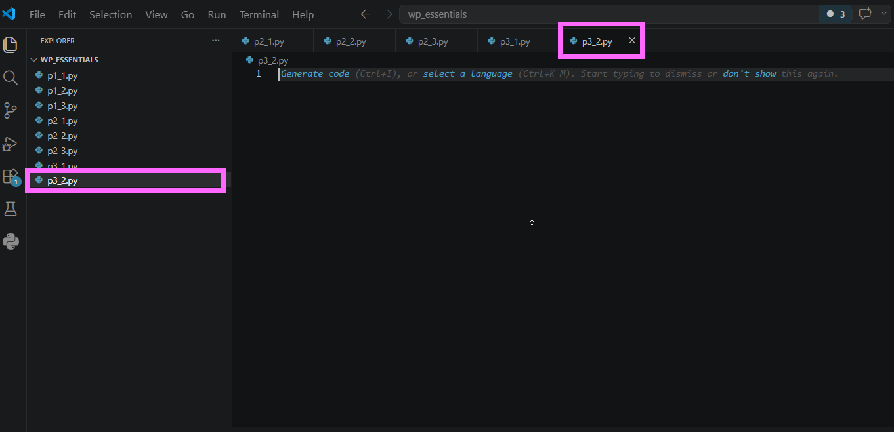
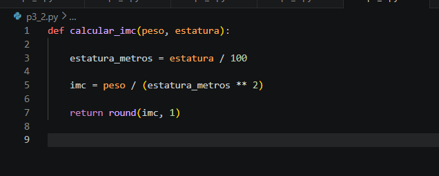
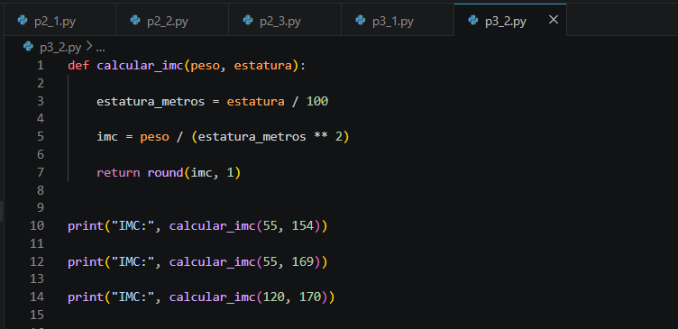
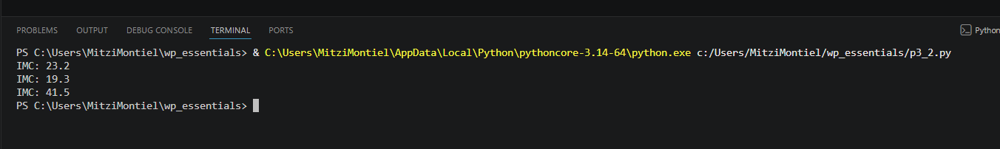
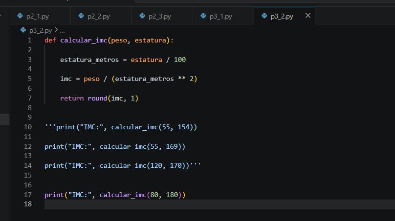
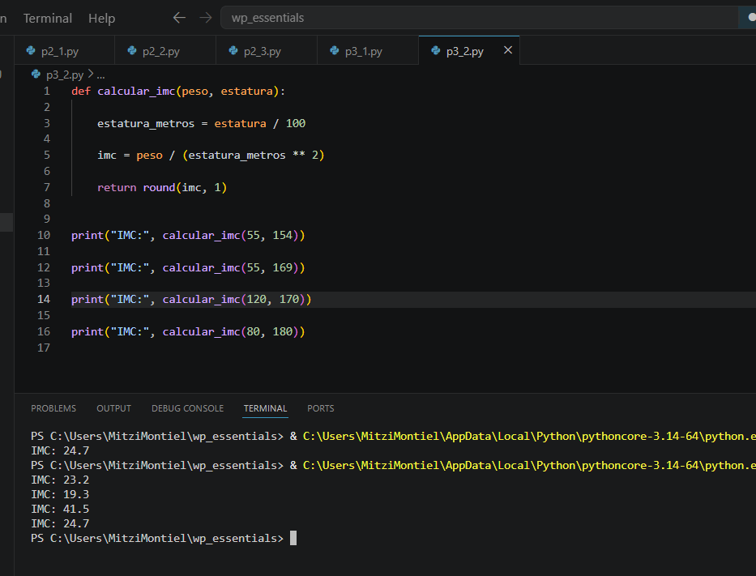

# Práctica 6.2. Funciones con parámetros y valores de retorno

## Objetivo de la práctica

Al finalizar esta práctica, serás capaz de:

- Crear funciones que reciban parámetros y devuelvan un valor mediante la instrucción `return`.
- Reutilizar funciones para resolver un mismo problema con diferentes datos de entrada.
- Aplicar operaciones aritméticas dentro de una función.
- Utilizar la función `round()` para controlar la cantidad de decimales en un resultado.

---

# Objetivo visual

Durante esta práctica desarrollarás una función que calcule el Índice de Masa Corporal (IMC) a partir del peso y la estatura de una persona.

```text
        Abrir Visual Studio Code
                   │
                   ▼
         Crear el archivo p3_2.py
                   │
                   ▼
      Crear una función con
      parámetros y return
                   │
                   ▼
     Calcular el IMC
                   │
                   ▼
      Invocar la función
      con distintos datos
                   │
                   ▼
      Mostrar los resultados
```


---

## Duración aproximada

**8 minutos**

---

# Tabla de ayuda

| Recurso | Valor |
|---------|-------|
| Editor | Visual Studio Code |
| Lenguaje | Python 3 |
| Archivo | `p3_2.py` |
| Funciones utilizadas | `round()`, `print()` |
| Conceptos | Parámetros, retorno (`return`) |

---

# Instrucciones

## Tarea 1. Crear una función con valor de retorno

### Paso 1. Crear un nuevo archivo

Crear un archivo llamado:

```text
p3_2.py
```




---

### Paso 2. Crear la función

Agregar el siguiente código.

```python
def calcular_imc(peso, estatura):

    estatura_metros = estatura / 100

    imc = peso / (estatura_metros ** 2)

    return round(imc, 1)
```

> **Nota:** La estatura se recibe en centímetros, por lo que primero debe convertirse a metros antes de calcular el IMC.

Guardar el archivo.




---

## Tarea 2. Invocar la función

### Paso 1. Agregar las llamadas a la función

Debajo de la función agregar el siguiente código.

```python
print("IMC:", calcular_imc(55, 154))

print("IMC:", calcular_imc(55, 169))

print("IMC:", calcular_imc(120, 170))
```

Guardar el archivo.



---

### Paso 2. Ejecutar el programa

Ejecutar el archivo.

```bash
python p3_2.py
```

Verificar que la salida sea similar a la siguiente.

```text
IMC: 23.2

IMC: 19.3

IMC: 41.5
```



---

## Tarea 3. Probar la función con nuevos datos

Agregar una nueva llamada utilizando diferentes valores.

Por ejemplo:

```python
print("IMC:", calcular_imc(80, 180))
```

Responder:

- ¿Qué resultado obtuvo?
- ¿Fue necesario modificar la función para realizar un nuevo cálculo?



---

## Tarea 4. Analizar el valor de retorno

Responder las siguientes preguntas.

1. ¿Qué hace la instrucción `return`?

2. ¿Qué diferencia existe entre `print()` y `return`?

3. ¿Qué ocurriría si la función no tuviera `return`?

4. ¿Por qué la función puede reutilizarse con diferentes personas?

5. ¿Qué función cumple `round(imc, 1)`?

---

# Validación

Verifique que realizó correctamente las siguientes actividades.

| Actividad | Completado |
|------------|------------|
| Creó el archivo `p3_2.py` | ☐ |
| Definió una función con parámetros | ☐ |
| Utilizó la instrucción `return` | ☐ |
| Calculó el IMC | ☐ |
| Invocó la función con distintos argumentos | ☐ |
| Utilizó la función `round()` | ☐ |

---

# Resultado esperado

Al finalizar la práctica el programa deberá producir una salida similar a la siguiente.

```text
IMC: 23.2

IMC: 19.3

IMC: 41.5

IMC: 24.7
```

> **Nota:** El último resultado corresponde al ejemplo utilizando los valores `80 kg` y `180 cm`.



---

# Conclusión

En esta práctica aprendiste a crear funciones que reciben parámetros y devuelven un resultado mediante la instrucción `return`. También comprobaste que una misma función puede reutilizarse con diferentes datos sin necesidad de modificar su implementación, favoreciendo la reutilización del código y la organización de los programas.

---

# Conocimientos adquiridos

Al finalizar esta práctica aprendiste a:

- Definir funciones con parámetros.
- Utilizar la instrucción `return`.
- Reutilizar funciones con diferentes argumentos.
- Aplicar operaciones aritméticas dentro de una función.
- Utilizar la función `round()` para controlar el número de decimales.
- Implementar una función para calcular el Índice de Masa Corporal (IMC).
