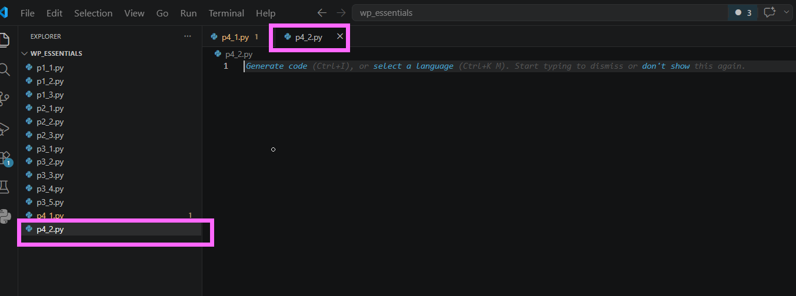
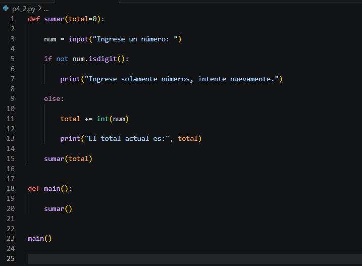
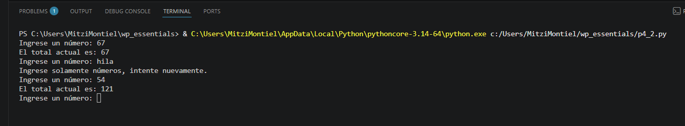
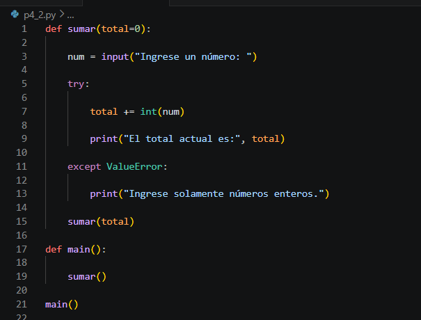
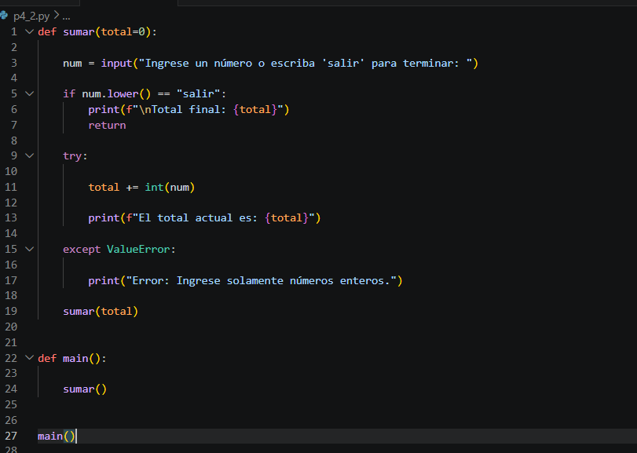

# Práctica 7.2. Sumar indefinidamente

## Objetivo de la práctica

Al finalizar esta práctica, serás capaz de:

- Utilizar excepciones para validar la entrada de datos.
- Sustituir validaciones tradicionales (`if-else`) por bloques `try-except`.
- Implementar funciones recursivas para ejecutar procesos repetitivos.
- Controlar errores de conversión de datos de forma elegante y segura.

---

# Objetivo visual

Durante esta práctica modificarás un programa que suma números de manera indefinida reemplazando las validaciones mediante `if` por el manejo de excepciones.

```text
Usuario ingresa un dato
          │
          ▼
       try:
          │
          ▼
 Convertir a entero
          │
     ┌────┴────┐
     │         │
     ▼         ▼
 Correcto   Excepción
     │         │
     ▼         ▼
Sumar total  Mostrar mensaje
     │         │
     └────┬────┘
          ▼
   Solicitar otro número
```

---

## Duración aproximada

**8 minutos**

---

# Tabla de ayuda

| Recurso | Valor |
|---------|-------|
| Editor | Visual Studio Code |
| Lenguaje | Python 3 |
| Archivo | `p4_2.py` |
| Conceptos | Recursividad, try, except, ValueError |

---

# Instrucciones

## Tarea 1. Crear el archivo

Crear un nuevo archivo llamado:




---

# Tarea 2. Agregar el programa original

Escribir el siguiente código.

```python
# Función suma recursiva

def sumar(total=0):

    num = input("Ingrese un número: ")

    if not num.isdigit():

        print("Ingrese solamente números, intente nuevamente.")

    else:

        total += int(num)

        print("El total actual es:", total)

    sumar(total)


def main():

    sumar()


main()
```

Guardar el archivo.



---

# Tarea 3. Ejecutar el programa

Ejecutar el programa desde la terminal.

```bash
python p4_2.py
```

Realizar varias pruebas:

- Ingresar números enteros.
- Ingresar texto.
- Ingresar caracteres especiales.

Observar el comportamiento del programa.



---

# Tarea 4. Sustituir la validación por manejo de excepciones

Modificar la función `sumar()` eliminando el bloque `if-else`.

Reemplazarlo por el siguiente código.

```python
def sumar(total=0):

    num = input("Ingrese un número: ")

    try:

        total += int(num)

        print("El total actual es:", total)

    except ValueError:

        print("Ingrese solamente números enteros.")

    sumar(total)
```

Guardar el archivo.




---

# Tarea 5. Ejecutar nuevamente el programa

Ejecutar otra vez el archivo.

```bash
python p4_2.py
```

Realizar las siguientes pruebas:

| Entrada | Resultado esperado |
|----------|-------------------|
| 10 | El total aumenta |
| 5 | El total aumenta |
| Hola | Se muestra un mensaje de error |
| Python | Se muestra un mensaje de error |
| 8 | El total continúa acumulándose |

Responder:

- ¿El programa continúa ejecutándose después del error?
- ¿Qué ventaja ofrece `try-except` frente a `if-else` en este caso?

---

# Tarea 6. Mejorar el programa

Modificar el programa para que el usuario pueda escribir:

```text
salir
```

y finalizar la ejecución.

Sugerencia:

```python
if num.lower() == "salir":
    return
```

Probar nuevamente el programa.



---

# Validación

Verifique que realizó correctamente las siguientes actividades.

| Actividad | Completado |
|------------|------------|
| Creó el archivo `p4_2.py` | ☐ |
| Ejecutó el programa original | ☐ |
| Sustituyó `if-else` por `try-except` | ☐ |
| Validó entradas correctas e incorrectas | ☐ |
| Agregó la opción para salir del programa | ☐ |

---

# Resultado esperado

Ejemplo de ejecución.

```text
Ingrese un número: 10
El total actual es: 10

Ingrese un número: 5
El total actual es: 15

Ingrese un número: Hola
Ingrese solamente números enteros.

Ingrese un número: 8
El total actual es: 23

Ingrese un número: salir
```


---

# Conclusión

En esta práctica comprobaste que el manejo de excepciones permite validar entradas de usuario de una manera más limpia y flexible que utilizando múltiples estructuras `if-else`. Además, observaste cómo una función recursiva puede mantener un proceso repetitivo mientras controla errores sin detener la ejecución del programa.

---

# Conocimientos adquiridos

Al finalizar esta práctica aprendiste a:

- Utilizar `try` y `except` para validar datos de entrada.
- Capturar excepciones del tipo `ValueError`.
- Implementar funciones recursivas.
- Mantener un acumulador durante múltiples llamadas recursivas.
- Mejorar la experiencia del usuario mediante el manejo adecuado de errores.